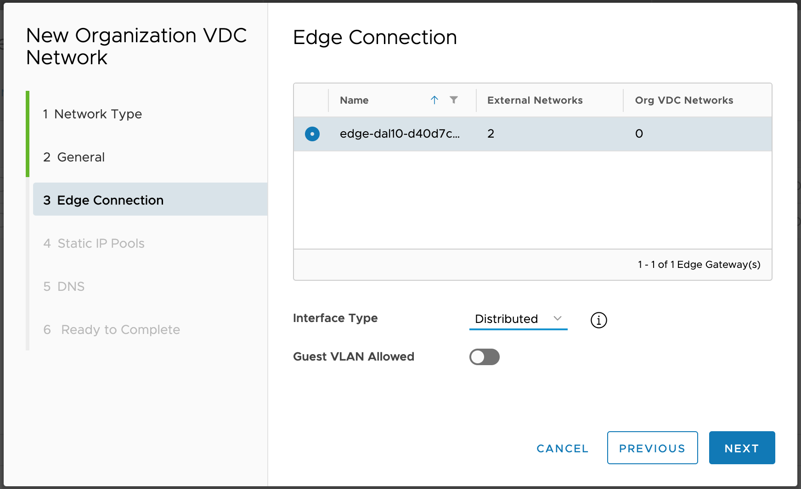

<!-- Copy and paste the converted output. -->

>>>>>  gd2md-html alert:  ERRORs: 2; WARNINGs: 1; ALERTS: 20.

<ul style="color: red; font-weight: bold"><li>See top comment block for details on ERRORs and WARNINGs. <li>In the converted Markdown or HTML, search for inline alerts that start with >>>>>  gd2md-html alert:  for specific instances that need correction.</ul>

Links to alert messages:
<a href="#gdcalert1">alert1</a>
<a href="#gdcalert2">alert2</a>
<a href="#gdcalert3">alert3</a>
<a href="#gdcalert4">alert4</a>
<a href="#gdcalert5">alert5</a>
<a href="#gdcalert6">alert6</a>
<a href="#gdcalert7">alert7</a>
<a href="#gdcalert8">alert8</a>
<a href="#gdcalert9">alert9</a>
<a href="#gdcalert10">alert10</a>
<a href="#gdcalert11">alert11</a>
<a href="#gdcalert12">alert12</a>
<a href="#gdcalert13">alert13</a>
<a href="#gdcalert14">alert14</a>
<a href="#gdcalert15">alert15</a>
<a href="#gdcalert16">alert16</a>
<a href="#gdcalert17">alert17</a>
<a href="#gdcalert18">alert18</a>
<a href="#gdcalert19">alert19</a>
<a href="#gdcalert20">alert20</a>

>>>>> PLEASE check and correct alert issues and delete this message and the inline alerts.

# 

>>>>>  gd2md-html alert: inline image link here (to images/image1.png). Store image on your image server and adjust path/filename/extension if necessary.  (<a href="#">Back to top</a>)(<a href="#gdcalert2">Next alert</a>) >>>>> 

# **HDM 2.1 - Org VDC System and Network Configuration**

 	                        

Version: 2.1

Publish Date: August, 2020

Copyright © 2020 PrimaryIO, Inc.

PrimaryIO, Inc.

300 3rd St, Los Altos

CA 94022

[http://www.primaryio.com](http://www.primaryio.com)

**Tel:** +1-877-817-7790

Copyright Notice

Copyright © 2020 PrimaryIO, Inc. 

This document is provided for informational purposes only and PrimaryIO makes no warranties, either expressed or implied in this document. 

Information in this document, including URL and other Internet references, is subject to change without notice. The entire risk of the use or the results from the use of this document remains with the user. 

Unless otherwise noted, the companies, organizations, products, domain names, e-mail addresses, logos, people, places, and events depicted in examples herein are fictitious. 

No association with any real company, organization, product, domain name, e-mail address, logo, person, place, or event is intended or should be inferred. 

Complying with all applicable copyright laws is the responsibility of the user. Without limiting the rights under copyright, no part of this document may be reproduced, stored in or introduced into a retrieval system, or transmitted in any form or by any means (electronic, mechanical, photocopying, recording, or otherwise), or for any purpose, without the written permission of PrimaryIO. 

PrimaryIO may have patents, patent applications, trademarks, copyrights, or other intellectual property rights covering subject matter in this document. Except as explicitly provided in any written license agreement from PrimaryIO, the furnishing of this document does not guarantee any license to these patents, trademarks, copyrights, or other intellectual property. 

© 2012 - 2020 PrimaryIO. 

All rights reserved. 

Trademarks

PrimaryIO HDM™ is a registered trademark of PrimaryIO, Inc in the United States and/or other jurisdictions. 

VMware is a registered trademark of VMware, Inc. in the United States and/or other jurisdictions.

All other trademarks referred to in this guide are owned by their respective companies.

[TOC]

# 

# About this Guide

The document describes the Organization VDC side network and system configuration required for HDM deployment.

# Network Configuration

## Step 1/3  : Create Routed Network UPLINK_WAN_NETWORK

This network will be connected to the edge gateway. Across WAN communication between on-premise and on-cloud for HDM appliance will be routed through this network. IPsec tunnel in 

>>>>>  gd2md-html alert: undefined internal link (link text: "step 3"). Did you generate a TOC?  (<a href="#">Back to top</a>)(<a href="#gdcalert3">Next alert</a>) >>>>> 

[step 3](#heading=h.yz6gu19o6yv1) will be configured to this network to complete the network configuration.

1. Create a new network and select Routed Network Type

>>>>>  gd2md-html alert: inline image link here (to images/image2.png). Store image on your image server and adjust path/filename/extension if necessary.  (<a href="#">Back to top</a>)(<a href="#gdcalert4">Next alert</a>) >>>>> 

2. Provide the name  “UPLINK_WAN_NETWORK” and Gateway CIDR for the network. Note the CIDR as this would be required when creating VPN connection between premise and edge gateway on cloud.

>>>>>  gd2md-html alert: inline image link here (to images/image3.png). Store image on your image server and adjust path/filename/extension if necessary.  (<a href="#">Back to top</a>)(<a href="#gdcalert5">Next alert</a>) >>>>> 

3. Select the edge gateway 

>>>>>  gd2md-html alert: inline image link here (to images/image4.png). Store image on your image server and adjust path/filename/extension if necessary.  (<a href="#">Back to top</a>)(<a href="#gdcalert6">Next alert</a>) >>>>> 

4. Specify static-ip pool of at least 20 IP addresses

>>>>>  gd2md-html alert: inline image link here (to images/image5.png). Store image on your image server and adjust path/filename/extension if necessary.  (<a href="#">Back to top</a>)(<a href="#gdcalert7">Next alert</a>) >>>>> 

5. Add DNS records if required

>>>>>  gd2md-html alert: inline image link here (to images/image6.png). Store image on your image server and adjust path/filename/extension if necessary.  (<a href="#">Back to top</a>)(<a href="#gdcalert8">Next alert</a>) >>>>> 

6. Review and click on finish to create the routed network

>>>>>  gd2md-html alert: inline image link here (to images/image7.png). Store image on your image server and adjust path/filename/extension if necessary.  (<a href="#">Back to top</a>)(<a href="#gdcalert9">Next alert</a>) >>>>> 

## 

## Step 2/3  : Create Isolated Network HDM_INTERNAL_NETWORK

This network will be created for HDM appliance communication and for migrating virtual machines across vApps for the same Org. VDC.

1. Create a new network and select Isolated Network Type

>>>>>  gd2md-html alert: inline image link here (to images/image8.png). Store image on your image server and adjust path/filename/extension if necessary.  (<a href="#">Back to top</a>)(<a href="#gdcalert10">Next alert</a>) >>>>> 

2. Provide the name “HDM_INTERNAL_NETWORK” and Gateway CIDR for the network. Make sure enough IPs are available in the subnet as this would be used for migrating virtual machines. The network would be assigned during migration and then removed post-migration.

>>>>>  gd2md-html alert: inline image link here (to images/image9.png). Store image on your image server and adjust path/filename/extension if necessary.  (<a href="#">Back to top</a>)(<a href="#gdcalert11">Next alert</a>) >>>>> 

3. Specify static-ip pool or at least 30 IPs.

>>>>>  gd2md-html alert: inline image link here (to images/image10.png). Store image on your image server and adjust path/filename/extension if necessary.  (<a href="#">Back to top</a>)(<a href="#gdcalert12">Next alert</a>) >>>>> 

 \

4. Review and click on finish to create the isolated network

>>>>>  gd2md-html alert: inline image link here (to images/image11.png). Store image on your image server and adjust path/filename/extension if necessary.  (<a href="#">Back to top</a>)(<a href="#gdcalert13">Next alert</a>) >>>>> 

## 

## Step 3/3  : Configure VPN tunnel with Org. Edge Gateway

Create an IPSec tunnel between the organization edge gateway and on-premise datacenter. To complete the VPN setting the following information would be required:

*   Local ID - Edge gateway tenant external network IP 
*   Local Endpoint - Edge gateway tenant external network IP
*   Local Subnets - Routed network subnet where HDM appliances will be deployed (

>>>>>  gd2md-html alert: undefined internal link (link text: "Create Routed Network"). Did you generate a TOC?  (<a href="#">Back to top</a>)(<a href="#gdcalert14">Next alert</a>) >>>>> 

[Create Routed Network](#heading=h.ocdg71kiwd4b))
*   Peer ID - Public IP for the on-premise WAN network
*   Peer Endpoint - Public IP for the on-premise WAN network
*   Peer Subnets - Subnet of the on-premise WAN network where HDM appliances will be deployed.

### Edge gateway VPN config 

>>>>>  gd2md-html alert: inline image link here (to images/image12.png). Store image on your image server and adjust path/filename/extension if necessary.  (<a href="#">Back to top</a>)(<a href="#gdcalert15">Next alert</a>) >>>>> 

### Recommended firewall rules

Add recommended firewall rule by specifying source and destination subnet

## 

>>>>>  gd2md-html alert: inline image link here (to images/image13.png). Store image on your image server and adjust path/filename/extension if necessary.  (<a href="#">Back to top</a>)(<a href="#gdcalert16">Next alert</a>) >>>>> 

### Service/Port level requirement for HDM(Advanced firewall rules)

1. Premise wan network - Cloud wan network ports(Inbound/Outbound):** **22, 2379, 32820, 2376, 6000-6050, 7000-7050, 8000-8050.

>>>>>  gd2md-html alert: inline image link here (to images/image14.png). Store image on your image server and adjust path/filename/extension if necessary.  (<a href="#">Back to top</a>)(<a href="#gdcalert17">Next alert</a>) >>>>> 

>>>>>  gd2md-html alert: inline image link here (to images/image15.png). Store image on your image server and adjust path/filename/extension if necessary.  (<a href="#">Back to top</a>)(<a href="#gdcalert18">Next alert</a>) >>>>> 

You can test the IPsec connectivity using ping command from on prem to cloud side routed network gateway. If you have configured advanced firewall rules please make sure ICMP traffic is allowed.

Ping test from premise to cloud side gateway

>>>>>  gd2md-html alert: inline image link here (to images/image16.png). Store image on your image server and adjust path/filename/extension if necessary.  (<a href="#">Back to top</a>)(<a href="#gdcalert19">Next alert</a>) >>>>> 

Ping test from Cloud to Premise IP, you need to create test machine on routed network of cloud side.

>>>>>  gd2md-html alert: inline image link here (to images/image17.png). Store image on your image server and adjust path/filename/extension if necessary.  (<a href="#">Back to top</a>)(<a href="#gdcalert20">Next alert</a>) >>>>> 

# 

# System Configuration

## Configure vApp for HDM Deployment

The components of HDM need to be deployed on a vApp. If you don’t already have a vApp for this purpose please create it.

Attach Org VDC network UPLINK_WAN_NETWORK and HDM_INTERNAL_NETWORK which were created in step 1 and 2 earlier in this document to vApp where HDM will be deployed. 

**NOTE: HDM_INTERNAL_NETWORK should be added to all vApps where VMs will be migrated.**

>>>>>  gd2md-html alert: inline image link here (to images/image18.png). Store image on your image server and adjust path/filename/extension if necessary.  (<a href="#">Back to top</a>)(<a href="#gdcalert21">Next alert</a>) >>>>> 

