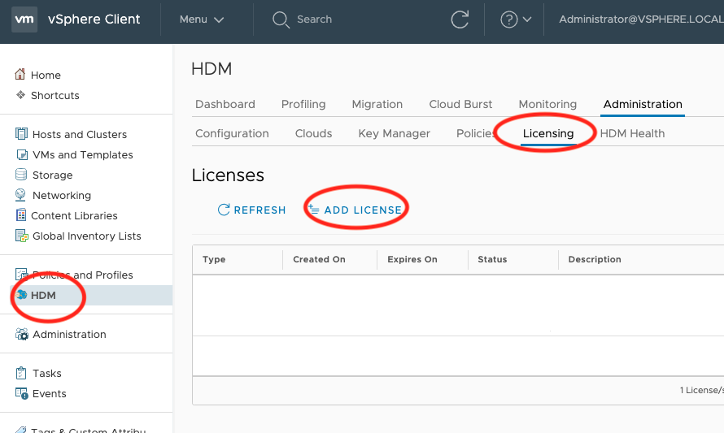
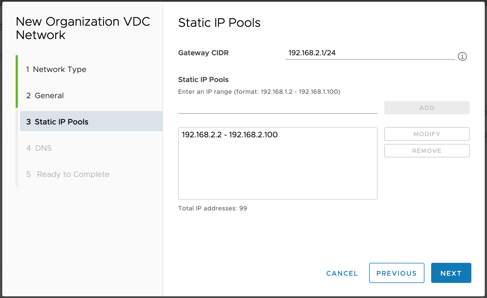

<!-- Copy and paste the converted output. -->


<p style="color: red; font-weight: bold">>>>>>  gd2md-html alert:  ERRORs: 6; WARNINGs: 0; ALERTS: 29.</p>
<ul style="color: red; font-weight: bold"><li>See top comment block for details on ERRORs and WARNINGs. <li>In the converted Markdown or HTML, search for inline alerts that start with >>>>>  gd2md-html alert:  for specific instances that need correction.</ul>

<p style="color: red; font-weight: bold">Links to alert messages:</p><a href="#gdcalert1">alert1</a>
<a href="#gdcalert2">alert2</a>
<a href="#gdcalert3">alert3</a>
<a href="#gdcalert4">alert4</a>
<a href="#gdcalert5">alert5</a>
<a href="#gdcalert6">alert6</a>
<a href="#gdcalert7">alert7</a>
<a href="#gdcalert8">alert8</a>
<a href="#gdcalert9">alert9</a>
<a href="#gdcalert10">alert10</a>
<a href="#gdcalert11">alert11</a>
<a href="#gdcalert12">alert12</a>
<a href="#gdcalert13">alert13</a>
<a href="#gdcalert14">alert14</a>
<a href="#gdcalert15">alert15</a>
<a href="#gdcalert16">alert16</a>
<a href="#gdcalert17">alert17</a>
<a href="#gdcalert18">alert18</a>
<a href="#gdcalert19">alert19</a>
<a href="#gdcalert20">alert20</a>
<a href="#gdcalert21">alert21</a>
<a href="#gdcalert22">alert22</a>
<a href="#gdcalert23">alert23</a>
<a href="#gdcalert24">alert24</a>
<a href="#gdcalert25">alert25</a>
<a href="#gdcalert26">alert26</a>
<a href="#gdcalert27">alert27</a>
<a href="#gdcalert28">alert28</a>
<a href="#gdcalert29">alert29</a>

<p style="color: red; font-weight: bold">>>>>> PLEASE check and correct alert issues and delete this message and the inline alerts.<hr></p>


## 


## **HDM 2.1 Quick Start Guide for VMware Cloud Director**
## **Single Network**

## About this Guide

This quick start guide is intended to help you rapidly deploy PrimaryIO HDM to a test environment. The steps are intended for a single on-premises network environment, with cloud access via a WAN link and no separation of the management and VM network. All IP assignments in this guide are static/static-pool and connectivity between the on-premises and cloud environments is via IPSec. For other types of network configurations, refer to the HDM 2.1 Install Guide.

HDM provides a flexible deployment model to cater to a wide range of user needs, including different use cases, performance requirements, scalability, and levels of security. The HDM 2.1 Install Guide contains full details of every deployment mode. For simplicity, this document describes an HDM deployment using the **_Standalone, Ultra-Lite_** option. This option supports all the key features of HDM and can also be used for cold migration and validation purposes. 

The following steps are required to deploy HDM:


1. Review System Requirements _(estimated time: 15 minutes)_
2. Download PrimaryIO HDM _(estimated time: 5 minutes – depending on Internet speed)_
3. Network Planning & Mapping _(estimated time: 20 minutes)_
4. Deploy the HDM Appliance _(estimated time: 5 minutes)_
5. Validate the Network Configuration _(estimated time: 5 minutes)_
6. On-premises Deployment _(estimated time: 10 minutes)_
7. Cloud Deployment _(estimated time: 45-60 minutes)_
8. Perform a Cold Migration_ (estimated time: dependent on VM size)_


## Step 1: Review System Requirements

Refer to the [System Requirements](https://docs.google.com/document/d/1X1YOf2LQIT1hdGFygKmUgE2BGPs6QXKp/edit?ts=5f55d761#heading=h.inqccfxv1izt) in Appendix A of this document. Printing a copy of Appendix A to use as a checklist is recommended. 


## Step 2: Download PrimaryIO HDM

To obtain your license and download link for HDM, visit [https://www.primaryio.com/ibm/](https://www.primaryio.com/ibm/)

You will receive an email with the following:


*   A link to download the PrimaryIO HDM software
*   A link to training videos
*   A license key for the software

Before proceeding with the installation, watch the training videos and use this guide. 


## Step 3: Network Planning and Mapping

Network configuration information is required at key points throughout the deployment process. So, develop a network connectivity plan prior to deploying HDM. This section will help guide you through that process. The information captured in this section will be employed later in the installation process. If an IPSec tunnel and cloud configuration have not yet been established, these must be done before moving any further. Follow the steps outlined in 

<p id="gdcalert2" ><span style="color: red; font-weight: bold">>>>>>  gd2md-html alert: undefined internal link (link text: "Appendix C"). Did you generate a TOC? </span><br>(<a href="#">Back to top</a>)(<a href="#gdcalert3">Next alert</a>)<br><span style="color: red; font-weight: bold">>>>>> </span></p>

[Appendix C](#heading=h.8n7jk8n5lwew) of this document. Please be aware that this process will add 30 minutes to the estimated time to complete this section. 

Once connectivity and cloud configuration are complete, be sure to record all applicable details in 

<p id="gdcalert3" ><span style="color: red; font-weight: bold">>>>>>  gd2md-html alert: undefined internal link (link text: "Appendix B"). Did you generate a TOC? </span><br>(<a href="#">Back to top</a>)(<a href="#gdcalert4">Next alert</a>)<br><span style="color: red; font-weight: bold">>>>>> </span></p>

[Appendix B](#heading=h.qqzzlrxclsfu) of this document for easy reference later in the deployment process. 

The following is required to complete the network plan: 


1. IPSec tunnel, firewall, and cloud network configuration information (See 

<p id="gdcalert4" ><span style="color: red; font-weight: bold">>>>>>  gd2md-html alert: undefined internal link (link text: "Appendix C"). Did you generate a TOC? </span><br>(<a href="#">Back to top</a>)(<a href="#gdcalert5">Next alert</a>)<br><span style="color: red; font-weight: bold">>>>>> </span></p>

[Appendix C](#heading=h.8n7jk8n5lwew))
2. Network requirements during OVF deployment
3. Network requirements during on-premises deployment
4. Network requirements during cloud deployment

    ```
Choose or Create an appropriate network:

A simple network configuration where all connectivity to the cloud is available through one network (e.g., hdm_network). Here hdm_network should have access to the following:
On-premises vCenter 
Cloud vCenter via WAN link
On-premises ESXi
Cloud ESXi
HDM Appliance

The required connectivity is highlighted in figure 1. For all steps in the deployment that require a VMware network as input, provide the identified or created hdm_network. It will also be necessary to create two networks in the cloud, hdm_routed_network and hdm_internal.

Failure to create, choose, or configure the networks correctly will cause the installation to fail.
```


    ```
Figure 1: Network Configuration of the Test Environment

```


The remainder of this document will assume you have created a network topology like the one shown in Figure 1, and will refer to the networks by those names. In this configuration, all access has been made possible using single VM network, _hdm_network_. Four static IPs will need to be provisioned on this network for OVF deployment.

You will need to provision 


*   20 static IPs on Premise network
*   At least 50 static-pool IPs on Cloud network

These will be required throughout the installation process.


```
NOTE: 
Despite the fact that you will be mapping to a single network, separate IP ranges will need to be provided for each network type.
The subnet range 172.17.0.0/16 is not available for the deployment; it is used internally by HDM microservices.
Please add the vCenter FQDN for the on-premises and cloud vCenters on the on-premises and cloud DNS servers.
```


Before continuing with the rest of this Quick Start Guide, be sure to print [Appendix B - Network Settings](https://docs.google.com/document/d/1X1YOf2LQIT1hdGFygKmUgE2BGPs6QXKp/edit#heading=h.qqzzlrxclsfu) and complete the forms. This will help you identify the correct networks to configure and identify all networking details.


## Step 4: Deploy the HDM Appliance


*   Make sure you have at least 10GB free space to download the appliance
*   Unzip the file _HDM_2.1.zip_ from the download link
*   Deploy the appliance using the vCenter UI 

<table>
  <tr>
   <td>


<p id="gdcalert5" ><span style="color: red; font-weight: bold">>>>>>  gd2md-html alert: inline image link here (to images/image2.png). Store image on your image server and adjust path/filename/extension if necessary. </span><br>(<a href="#">Back to top</a>)(<a href="#gdcalert6">Next alert</a>)<br><span style="color: red; font-weight: bold">>>>>> </span></p>


   </td>
   <td>
<ul>

<li>Perform the step as directed by the UI.

<li>Select <em>hdm_network</em> as the destination for all networks.

<li>Please refer to the “Network Configuration for the Appliance” section in the HDM Installation Guide for details on the network configuration.
    .
</li>
</ul>
   </td>
  </tr>
</table>


 


<table>
  <tr>
   <td>

<p id="gdcalert6" ><span style="color: red; font-weight: bold">>>>>>  gd2md-html alert: inline image link here (to images/image3.png). Store image on your image server and adjust path/filename/extension if necessary. </span><br>(<a href="#">Back to top</a>)(<a href="#gdcalert7">Next alert</a>)<br><span style="color: red; font-weight: bold">>>>>> </span></p>


   </td>
   <td>
<ul>

<li>Complete the network properties as captured in <a href="https://docs.google.com/document/d/1X1YOf2LQIT1hdGFygKmUgE2BGPs6QXKp/edit#heading=h.qqzzlrxclsfu">Appendix B - Network Settings</a>

<li>Be sure to enter “Default Gateway” the IP address of the default gateway of the network.

<li>Power the appliance on after deploying it
</li>
</ul>
   </td>
  </tr>
</table>


## Step 5: Validate the Network Configuration


<table>
  <tr>
   <td>
   </td>
   <td>
<ul>

<li>All ESXi servers in vCenter should be connected
</li>
</ul>
   </td>
  </tr>
</table>


<table>
  <tr>
   <td>
   </td>
   <td>
<ul>

<li>The ESXi server must be able to communicate with vCenter. Test this using the ping command from the ESXi server to the vCenter FQDN (or IP)

<li>Check to ensure the appliance is powered on
</li>
</ul>
   </td>
  </tr>
</table>


## Step 6: On-premises Deployment


### Add on-premise vCenter


*   Locate the IP address of the appliance
*   Enter _https://&lt;appliance-ip>_ in the appliance web interface
*   Login to the appliance web UI using default password: 2Hdm$aK!N@h!
*   After login, select 

<p id="gdcalert7" ><span style="color: red; font-weight: bold">>>>>>  gd2md-html alert: inline image link here (to images/image4.png). Store image on your image server and adjust path/filename/extension if necessary. </span><br>(<a href="#">Back to top</a>)(<a href="#gdcalert8">Next alert</a>)<br><span style="color: red; font-weight: bold">>>>>> </span></p>


<table>
  <tr>
   <td>


<p id="gdcalert8" ><span style="color: red; font-weight: bold">>>>>>  gd2md-html alert: inline image link here (to images/image5.png). Store image on your image server and adjust path/filename/extension if necessary. </span><br>(<a href="#">Back to top</a>)(<a href="#gdcalert9">Next alert</a>)<br><span style="color: red; font-weight: bold">>>>>> </span></p>


   </td>
   <td>
<ul>

<li>Select <em>Add vCenter</em>
</li>
</ul>
   </td>
  </tr>
</table>


<table>
  <tr>
   <td>

<p id="gdcalert9" ><span style="color: red; font-weight: bold">>>>>>  gd2md-html alert: inline image link here (to images/image6.png). Store image on your image server and adjust path/filename/extension if necessary. </span><br>(<a href="#">Back to top</a>)(<a href="#gdcalert10">Next alert</a>)<br><span style="color: red; font-weight: bold">>>>>> </span></p>


   </td>
   <td>
<ul>

<li>Enter the vCenter credentials

<li>Select <em>Add</em>
</li>
</ul>
   </td>
  </tr>
</table>


<table>
  <tr>
   <td>

<p id="gdcalert10" ><span style="color: red; font-weight: bold">>>>>>  gd2md-html alert: inline image link here (to images/image7.png). Store image on your image server and adjust path/filename/extension if necessary. </span><br>(<a href="#">Back to top</a>)(<a href="#gdcalert11">Next alert</a>)<br><span style="color: red; font-weight: bold">>>>>> </span></p>


   </td>
   <td>Register the vCenter plugin by selecting <em>Register</em>
   </td>
  </tr>
</table>


vCenter configuration is now complete. Log into the newly-configured vCenter.


```
Note:
For the plugin to be visible within vCenter, you will need to logout/login to the vCenter at least twice.
```


### Configure the License

Navigate to the _Licensing_ page on the HDM vCenter Plugin


<table>
  <tr>
   <td>

<p id="gdcalert11" ><span style="color: red; font-weight: bold">>>>>>  gd2md-html alert: inline image link here (to images/image8.png). Store image on your image server and adjust path/filename/extension if necessary. </span><br>(<a href="#">Back to top</a>)(<a href="#gdcalert12">Next alert</a>)<br><span style="color: red; font-weight: bold">>>>>> </span></p>


   </td>
   <td>
<ul>

<li>HDM plugin can be accessed directly via the Menu

<li>It can take approximately five minutes to load HDM the first time it is accessed

<li>On the <em>Licensing</em> tab, select <em>Add License</em>

<li>Add the license key received by mail
</li>
</ul>
   </td>
  </tr>
</table>


### Configure the On-premises vCenter


<table>
  <tr>
   <td>

<p id="gdcalert12" ><span style="color: red; font-weight: bold">>>>>>  gd2md-html alert: inline image link here (to images/image9.png). Store image on your image server and adjust path/filename/extension if necessary. </span><br>(<a href="#">Back to top</a>)(<a href="#gdcalert13">Next alert</a>)<br><span style="color: red; font-weight: bold">>>>>> </span></p>


   </td>
   <td>
<ul>

<li>Select <em>Administration</em>, then <em>Configuration</em>

<li>Choose the cluster where you want to install vCenter

<li>Select <em>Install</em>
</li>
</ul>
   </td>
  </tr>
</table>


<table>
  <tr>
   <td>

<p id="gdcalert13" ><span style="color: red; font-weight: bold">>>>>>  gd2md-html alert: inline image link here (to images/image10.png). Store image on your image server and adjust path/filename/extension if necessary. </span><br>(<a href="#">Back to top</a>)(<a href="#gdcalert14">Next alert</a>)<br><span style="color: red; font-weight: bold">>>>>> </span></p>


   </td>
   <td>
<ul>

<li>For vCD, choose: 
<ul>
 
<li>Resource: Ultra-Lite
 
<li>Deployment: Cluster or Standalone
</li> 
</ul>

<li>Only choose these options (this guide is only tailored to this configuration)
</li>
</ul>
   </td>
  </tr>
</table>


<table>
  <tr>
   <td>

<p id="gdcalert14" ><span style="color: red; font-weight: bold">>>>>>  gd2md-html alert: inline image link here (to images/image11.png). Store image on your image server and adjust path/filename/extension if necessary. </span><br>(<a href="#">Back to top</a>)(<a href="#gdcalert15">Next alert</a>)<br><span style="color: red; font-weight: bold">>>>>> </span></p>


   </td>
   <td>
<ul>

<li>Complete all steps to begin the deployment

<li>Complete the configuration details using the information you recorded in 

<p id="gdcalert15" ><span style="color: red; font-weight: bold">>>>>>  gd2md-html alert: undefined internal link (link text: "Appendix B - Network Settings"). Did you generate a TOC? </span><br>(<a href="#">Back to top</a>)(<a href="#gdcalert16">Next alert</a>)<br><span style="color: red; font-weight: bold">>>>>> </span></p>

<a href="#heading=h.qqzzlrxclsfu">Appendix B - Network Settings</a>

<li>If there are any errors in the network configuration, please resolve

<li>For additional details, refer to the “Deploy HDM On-premises” section in the HDM 2.1 Installation Guide

<li>This step will take a few minutes to complete. Progress will be shown on the vCenter task bar.
</li>
</ul>
   </td>
  </tr>
</table>


## Step 7: Cloud Deployment


###      Cloud Static-Pool allocation


<table>
  <tr>
   <td>

<p id="gdcalert16" ><span style="color: red; font-weight: bold">>>>>>  gd2md-html alert: inline image link here (to images/image12.png). Store image on your image server and adjust path/filename/extension if necessary. </span><br>(<a href="#">Back to top</a>)(<a href="#gdcalert17">Next alert</a>)<br><span style="color: red; font-weight: bold">>>>>> </span></p>


   </td>
   <td>
<ul>

<li>Allocate static-pool IPs for <em>hdm_internal</em> and <em>hdm_routed_network</em>

<li>The procedure is detailed in document “HDM 2.1 Quick Start Guide - VCD - Single Network”

<li>Allocated 20 IPs on <em>hdm_internal</em>

<li>Allocate 30 IPs on <em>hdm_routed_network</em>

<li>Data in is used to assign these static ranges
</li>
</ul>
   </td>
  </tr>
</table>


### Configure Cloud vCenter


<table>
  <tr>
   <td>

<p id="gdcalert17" ><span style="color: red; font-weight: bold">>>>>>  gd2md-html alert: inline image link here (to images/image13.png). Store image on your image server and adjust path/filename/extension if necessary. </span><br>(<a href="#">Back to top</a>)(<a href="#gdcalert18">Next alert</a>)<br><span style="color: red; font-weight: bold">>>>>> </span></p>


   </td>
   <td>
<ul>

<li>Select <em>Clouds</em>, then <em>Add Cloud</em>

<li>The cloud configuration wizard will pop-up automatically
</li>
</ul>
   </td>
  </tr>
</table>


<table>
  <tr>
   <td>

<p id="gdcalert18" ><span style="color: red; font-weight: bold">>>>>>  gd2md-html alert: inline image link here (to images/image14.png). Store image on your image server and adjust path/filename/extension if necessary. </span><br>(<a href="#">Back to top</a>)(<a href="#gdcalert19">Next alert</a>)<br><span style="color: red; font-weight: bold">>>>>> </span></p>


   </td>
   <td>
<ul>

<li>Choose vCloud Director

<li>Enter vCD credentials

<li>Select <em>Add</em>

<li>Please note, it will take approximately 5 minutes to configure vCD and move to the next screen
</li>
</ul>
   </td>
  </tr>
</table>


<table>
  <tr>
   <td>

<p id="gdcalert19" ><span style="color: red; font-weight: bold">>>>>>  gd2md-html alert: inline image link here (to images/image15.png). Store image on your image server and adjust path/filename/extension if necessary. </span><br>(<a href="#">Back to top</a>)(<a href="#gdcalert20">Next alert</a>)<br><span style="color: red; font-weight: bold">>>>>> </span></p>


   </td>
   <td>
<ul>

<li>Choose vApp to deploy HDM cloud components

<li>Choose the highest performance for rapid transfer
</li>
</ul>
   </td>
  </tr>
</table>


<table>
  <tr>
   <td>

<p id="gdcalert20" ><span style="color: red; font-weight: bold">>>>>>  gd2md-html alert: inline image link here (to images/image16.png). Store image on your image server and adjust path/filename/extension if necessary. </span><br>(<a href="#">Back to top</a>)(<a href="#gdcalert21">Next alert</a>)<br><span style="color: red; font-weight: bold">>>>>> </span></p>


   </td>
   <td>
<ul>

<li>For Parts 1 and 2, choose <em>Static Pool</em>
</li>
</ul>
   </td>
  </tr>
</table>


#### WAN Routing Configuration

The following WAN routes are required to gain access between the cloud and on-premises environments:


*   **Onprem WAN network details: **The route that is set on the on-premises HDM appliance. The routes enable communication from on-premises to cloud HDM appliances.
    *   **Onprem WAN subnet(s): **Location of the deployed HDM appliances
    *   **Onprem WAN gateway: **Enables access to the cloud WAN subnet
*   **Oncloud WAN network details: **The route that is set on the HDM appliance in the cloud. The routes enable communication from the cloud to on-premises HDM appliances.
    *   **Oncloud WAN subnet(s): **Location of the deployed HDM appliances
    *   **Oncloud WAN gateway: **Enables access to on-premises WAN subnet

<table>
  <tr>
   <td>


<p id="gdcalert21" ><span style="color: red; font-weight: bold">>>>>>  gd2md-html alert: inline image link here (to images/image17.png). Store image on your image server and adjust path/filename/extension if necessary. </span><br>(<a href="#">Back to top</a>)(<a href="#gdcalert22">Next alert</a>)<br><span style="color: red; font-weight: bold">>>>>> </span></p>




   </td>
   <td>
<ul>

<li>Complete with the correct routes for the chosen configuration
</li>
</ul>
   </td>
  </tr>
</table>


<table>
  <tr>
   <td>

<p id="gdcalert22" ><span style="color: red; font-weight: bold">>>>>>  gd2md-html alert: inline image link here (to images/image18.png). Store image on your image server and adjust path/filename/extension if necessary. </span><br>(<a href="#">Back to top</a>)(<a href="#gdcalert23">Next alert</a>)<br><span style="color: red; font-weight: bold">>>>>> </span></p>


   </td>
   <td>
<ul>

<li>Use the configuration information recorded in 

<p id="gdcalert23" ><span style="color: red; font-weight: bold">>>>>>  gd2md-html alert: undefined internal link (link text: "Appendix B"). Did you generate a TOC? </span><br>(<a href="#">Back to top</a>)(<a href="#gdcalert24">Next alert</a>)<br><span style="color: red; font-weight: bold">>>>>> </span></p>

<a href="#heading=h.qqzzlrxclsfu">Appendix B</a>

<li>Map on-premises to the cloud network to enable application connectivity

<li>If there are any errors in the network configuration, please resolve

<li>Depending on the chosen configuration and uplink speed, this step may require up to an hour to complete
</li>
</ul>
   </td>
  </tr>
</table>


<table>
  <tr>
   <td>

<p id="gdcalert24" ><span style="color: red; font-weight: bold">>>>>>  gd2md-html alert: inline image link here (to images/image19.png). Store image on your image server and adjust path/filename/extension if necessary. </span><br>(<a href="#">Back to top</a>)(<a href="#gdcalert25">Next alert</a>)<br><span style="color: red; font-weight: bold">>>>>> </span></p>


   </td>
   <td>
<ul>

<li>To ensure the deployment has been successful, select <em>HDM</em> from the Menu, followed by the <em>Administration</em>, <em>HDM Health</em>, and <em>Component Health</em> tabs

<li>Check the status. If it is green, it is ready to begin migration 
</li>
</ul>
   </td>
  </tr>
</table>


## Step 8: Perform a Cold Migration

During cold migration, the VM being migrated is powered off. After the migration has been completed on the cloud, the VM can be powered back on.


```
NOTES:
Migrations will be successful for VMs where network and disk interfaces are accessible to HDM via VMware APIs.
If network or disk interfaces are added dynamically, the virtual machine will need to be powered down to allow the newly added network and disk interface information to become available to HDM via VMware APIs.
Before migration is triggered, ensure that the health of the HDM components is green. 
```


 


<table>
  <tr>
   <td>

<p id="gdcalert25" ><span style="color: red; font-weight: bold">>>>>>  gd2md-html alert: inline image link here (to images/image20.jpg). Store image on your image server and adjust path/filename/extension if necessary. </span><br>(<a href="#">Back to top</a>)(<a href="#gdcalert26">Next alert</a>)<br><span style="color: red; font-weight: bold">>>>>> </span></p>


   </td>
   <td>
<ul>

<li>Right-click on the VM 

<li>Select <em>Migrate</em>

<li>The migration wizard will pop-up automatically
</li>
</ul>
   </td>
  </tr>
</table>


<table>
  <tr>
   <td>

<p id="gdcalert26" ><span style="color: red; font-weight: bold">>>>>>  gd2md-html alert: inline image link here (to images/image21.png). Store image on your image server and adjust path/filename/extension if necessary. </span><br>(<a href="#">Back to top</a>)(<a href="#gdcalert27">Next alert</a>)<br><span style="color: red; font-weight: bold">>>>>> </span></p>


   </td>
   <td>
<ul>

<li>Complete all steps 
</li>
</ul>
   </td>
  </tr>
</table>


<table>
  <tr>
   <td>


<p id="gdcalert27" ><span style="color: red; font-weight: bold">>>>>>  gd2md-html alert: inline image link here (to images/image22.png). Store image on your image server and adjust path/filename/extension if necessary. </span><br>(<a href="#">Back to top</a>)(<a href="#gdcalert28">Next alert</a>)<br><span style="color: red; font-weight: bold">>>>>> </span></p>




   </td>
   <td>
<ul>

<li>The migration status will be displayed in the wizard, as well as in vCenter tasks

<li>Following successful migration, the VM will be ready for use in the cloud

<li>To migrate multiple VMs and the HDM dashboard, please refer to the HDM 2.1 Admin Guide
</li>
</ul>
   </td>
  </tr>
</table>


  


## 


## Appendix A - System Requirements


<table>
  <tr>
   <td><strong>Requirement</strong>
   </td>
   <td><strong>Available (Yes / No)</strong>
   </td>
  </tr>
  <tr>
   <td>On-premises Requirements
   </td>
   <td>
   </td>
  </tr>
  <tr>
   <td>VMWare Environment
   </td>
   <td>
   </td>
  </tr>
  <tr>
   <td>Single version of ESX throughout the vCenter cluster
   </td>
   <td>
   </td>
  </tr>
  <tr>
   <td>ESX in connected state in the vCenter
   </td>
   <td>
   </td>
  </tr>
  <tr>
   <td>ESX able to communicate with vCenter
   </td>
   <td>
   </td>
  </tr>
  <tr>
   <td>Clusters have ESX 6.5U2+ and 6.7 
   </td>
   <td>
   </td>
  </tr>
  <tr>
   <td>vCenter Web Client: 6.5 or 6.7 
<p>
(Use of HTML client is recommended with Chrome v.75 +)
   </td>
   <td>
   </td>
  </tr>
  <tr>
   <td>Datastore should be VMFS, NFS, or NFSv3
   </td>
   <td>
   </td>
  </tr>
  <tr>
   <td>E1000E and VMXNet3 network adapters should be available in the on-premises vCenter
   </td>
   <td>
   </td>
  </tr>
  <tr>
   <td>DRS is enabled and HA should be enabled on the vCenter cluster 
   </td>
   <td>
   </td>
  </tr>
  <tr>
   <td>Network Environment
   </td>
   <td>
   </td>
  </tr>
  <tr>
   <td>Network speed: at least 1 Gbps (10 Gbps link is preferred)
   </td>
   <td>
   </td>
  </tr>
  <tr>
   <td>VM Network has connectivity to the cloud endpoint 
   </td>
   <td>
   </td>
  </tr>
  <tr>
   <td>VM Network has access to ESXi
   </td>
   <td>
   </td>
  </tr>
  <tr>
   <td>Hardware Requirements
   </td>
   <td>
   </td>
  </tr>
  <tr>
   <td>

<table>
  <tr>
   <td>On-premises
   </td>
   <td><strong>Total resources required for HDM</strong>
<p>
11 vCPU, 16 GB RAM, 336 GB disk
   </td>
   <td><strong>1</strong> Appliance (4 vCPU, 8 GB RAM, 144 GB disk), \
<strong>1</strong> PremMgr (3 vCPU, 4 GB RAM, 32 GB disk),
<p>
<strong>1</strong> ESXMgr (4 vCPU, 4GB RAM, 160 GB disk)
   </td>
  </tr>
  <tr>
   <td>Cloud
   </td>
   <td><strong>Total resources required for HDM equivalent to</strong>
<p>
10 vCPU, 26 GB RAM, 64 GB disk, 512 GB Cache
   </td>
   <td><strong>1 </strong>CloudMgr (4 vCPU, 6 GB RAM, 32 GB disk), \
<strong>1</strong> CloudCache (6 vCPU, 20 GB RAM, 32 GB disk, 512 GB cache)
   </td>
  </tr>
</table>


Related document: For hardware and system requirements, refer to the [VMware Hardware Compatibility List (HCL).](https://www.vmware.com/resources/compatibility/search.php)

   </td>
   <td>
   </td>
  </tr>
  <tr>
   <td>Cloud Requirements

   </td>
   <td>
   </td>
  </tr>
  <tr>
   <td>Network connectivity between on-premises and cloud environments


*   Network Link: at least 1 Gbps
*   Network Round Trip Time Latencies: less than 30 ms
   </td>
   <td>
   </td>
  </tr>
</table>


**[Back to Top](https://docs.google.com/document/d/1X1YOf2LQIT1hdGFygKmUgE2BGPs6QXKp/edit?ts=5f55d761#heading=h.pj7rznux9t2f)**


## 


## Appendix B - Network Settings


### Network requirements during OVF deployment


*   Provision four IPs on _hdm_network_
*   Use this during OVF deployment

<table>
  <tr>
   <td>
<strong>Network</strong>
   </td>
   <td>IP 
   </td>
   <td>Netmask
   </td>
   <td>Gateway
   </td>
  </tr>
  <tr>
   <td>VM Network (Management Network)
   </td>
   <td><em>Single IP</em>
   </td>
   <td>
   </td>
   <td>
   </td>
  </tr>
  <tr>
   <td>HDM_Internal_Network
   </td>
   <td><em>Single IP</em>
   </td>
   <td>
   </td>
   <td>
   </td>
  </tr>
  <tr>
   <td>Uplink_WAN_Network
   </td>
   <td><em>Single IP</em>
   </td>
   <td>
   </td>
   <td>
   </td>
  </tr>
  <tr>
   <td>ESXi_Network
   </td>
   <td><em>Single IP</em>
   </td>
   <td>
   </td>
   <td>
   </td>
  </tr>
</table>


Common settings for the OVF deployment


<table>
  <tr>
   <td>Default gateway network
   </td>
   <td><em>This should be the single configured network on-premises which in this document is “hdm_network”</em>
   </td>
  </tr>
  <tr>
   <td>NTP Server
   </td>
   <td>
   </td>
  </tr>
  <tr>
   <td>Network DNS
   </td>
   <td>
   </td>
  </tr>
  <tr>
   <td>Default gateway
   </td>
   <td><em>Provide default gateway for the “hdm_network”</em>
   </td>
  </tr>
  <tr>
   <td>Network DNS Search Path
   </td>
   <td>
   </td>
  </tr>
</table>


### Network requirements during on-premises deployment

Common settings for the gateway, subnet, DNS etc., which will be common across the on-premises networks.


<table>
  <tr>
   <td><strong>Subnet mask</strong>
   </td>
   <td><em>255.255.0.0</em>
   </td>
   <td>
   </td>
  </tr>
  <tr>
   <td><strong>Gateway</strong>
   </td>
   <td><em>192.168.10.1</em>
   </td>
   <td>
   </td>
  </tr>
  <tr>
   <td><strong>Domain</strong>
   </td>
   <td><em>domain.lan</em>
   </td>
   <td>
   </td>
  </tr>
  <tr>
   <td><strong>DNS</strong>
   </td>
   <td><em>192.168.5.20, 192.168.5.21</em> 
   </td>
   <td>
   </td>
  </tr>
  <tr>
   <td><strong>NTP</strong>
   </td>
   <td><em>192.168.5.22</em>
   </td>
   <td>
   </td>
  </tr>
</table>


**HDM_Internal_Network**

Provision six IPs on _hdm_network_. complete the table below for reference throughout deployment.


<table>
  <tr>
   <td>
   </td>
   <td><strong>Example</strong>
   </td>
   <td><strong>Fill value here</strong>
   </td>
  </tr>
  <tr>
   <td><strong>IP range</strong>
   </td>
   <td><em>192.168.10.100-192.168.10.120, 192.168.10.130 </em>
   </td>
   <td><strong>(2 IPs required from “hdm_network” )</strong>
   </td>
  </tr>
</table>


** \
Uplink_WAN_Network**


<table>
  <tr>
   <td>
   </td>
   <td><strong>Example</strong>
   </td>
   <td><strong>Fill value here</strong>
   </td>
  </tr>
  <tr>
   <td><strong>IP range</strong>
   </td>
   <td><em>192.168.10.100-192.168.10.120, 192.168.10.130 </em>
   </td>
   <td><strong>(2 IPs required from “hdm_network”)</strong>
   </td>
  </tr>
</table>


**ESXi_Network**


<table>
  <tr>
   <td>
   </td>
   <td><strong>Example</strong>
   </td>
   <td><strong>Fill value here</strong>
   </td>
  </tr>
  <tr>
   <td><strong>IP range</strong>
   </td>
   <td><em>192.168.10.100-192.168.10.120, 192.168.10.130 </em>
   </td>
   <td><strong>(2 IPs required from “hdm_network”)</strong>
   </td>
  </tr>
</table>


### Network requirements during cloud deployment

The following cloud credentials are required to deploy to the cloud.


<table>
  <tr>
   <td><strong>vCloud Director FQDN</strong>
   </td>
   <td><em>xyzpqr25.vmware-solutions.cloud.ibm.com</em>
   </td>
  </tr>
  <tr>
   <td><strong>Organization name</strong>
   </td>
   <td>
   </td>
  </tr>
  <tr>
   <td><strong>Username</strong>
   </td>
   <td>
   </td>
  </tr>
  <tr>
   <td><strong>Password</strong>
   </td>
   <td>
   </td>
  </tr>
</table>


Similar to the previous two deployment stages, provision IPs and identify the correct networks to satisfy the chosen connectivity requirements. The networks to be configured are _HDM Internal network_ and _WAN network configuration** **_from the cloud _hdm_wan_network**. **_Only the IP Range is different between the two networks; all other parameters remain the same.

**HDM Internal network** 


<table>
  <tr>
   <td>
   </td>
   <td><strong>Example</strong>
   </td>
   <td><strong>Fill value here</strong>
   </td>
  </tr>
  <tr>
   <td><strong>IP range</strong>
   </td>
   <td><em>192.168.10.100-192.168.10.120, 192.168.10.130 </em>
   </td>
   <td><strong>(20 IPs from HDM “hdm_internal)</strong>
   </td>
  </tr>
  <tr>
   <td><strong>Subnet mask</strong>
   </td>
   <td><em>255.255.0.0</em>
   </td>
   <td>
   </td>
  </tr>
  <tr>
   <td><strong>Gateway</strong>
   </td>
   <td><em>192.168.10.1</em>
   </td>
   <td>
   </td>
  </tr>
  <tr>
   <td><strong>Domain</strong>
   </td>
   <td><em>domain.lan</em>
   </td>
   <td>
   </td>
  </tr>
  <tr>
   <td><strong>DNS</strong>
   </td>
   <td><em>192.168.5.20, 192.168.5.21</em> 
   </td>
   <td>
   </td>
  </tr>
  <tr>
   <td><strong>NTP</strong>
   </td>
   <td><em>192.168.5.22</em>
   </td>
   <td>
   </td>
  </tr>
</table>


**WAN network configuration**


<table>
  <tr>
   <td>
   </td>
   <td><strong>Example</strong>
   </td>
   <td><strong>Fill value here</strong>
   </td>
  </tr>
  <tr>
   <td><strong>IP range</strong>
   </td>
   <td><em>192.168.10.100-192.168.10.120, 192.168.10.130 </em>
   </td>
   <td><strong>(30 IPs from “hdm_wan_network”)</strong>
   </td>
  </tr>
  <tr>
   <td><strong>Subnet mask</strong>
   </td>
   <td><em>255.255.0.0</em>
   </td>
   <td>
   </td>
  </tr>
  <tr>
   <td><strong>Gateway</strong>
   </td>
   <td><em>192.168.10.1</em>
   </td>
   <td>
   </td>
  </tr>
  <tr>
   <td><strong>Domain</strong>
   </td>
   <td><em>domain.lan</em>
   </td>
   <td>
   </td>
  </tr>
  <tr>
   <td><strong>DNS</strong>
   </td>
   <td><em>192.168.5.20, 192.168.5.21</em> 
   </td>
   <td>
   </td>
  </tr>
  <tr>
   <td><strong>NTP</strong>
   </td>
   <td><em>192.168.5.22</em>
   </td>
   <td>
   </td>
  </tr>
</table>


## Appendix C - IPSec Configuration

Requirements to deploy HDM:


1. IPSec connectivity between on-premises and the vCD endpoint
2. Firewall rules configured to enable required traffic
3. Network configured correctly on the cloud side

Each of the above steps are discussed in detail in the HDM 2.1 - Org VDC System and Network Configuration.

Be sure to configure the cloud network as shown in the diagram in 

<p id="gdcalert28" ><span style="color: red; font-weight: bold">>>>>>  gd2md-html alert: undefined internal link (link text: "Step 3: Network Planning and Mapping"). Did you generate a TOC? </span><br>(<a href="#">Back to top</a>)(<a href="#gdcalert29">Next alert</a>)<br><span style="color: red; font-weight: bold">>>>>> </span></p>

[Step 3: Network Planning and Mapping](#heading=h.hfd4xpbh4o9a).

**Firewall configuration in the cloud**

**_NOTE: The following firewall configuration is recommended for all on-premises and cloud endpoints:_**


*   Source: source subnet
*   Destination: destination subnet
*   Service: any


<p id="gdcalert29" ><span style="color: red; font-weight: bold">>>>>>  gd2md-html alert: inline image link here (to images/image23.png). Store image on your image server and adjust path/filename/extension if necessary. </span><br>(<a href="#">Back to top</a>)(<a href="#gdcalert30">Next alert</a>)<br><span style="color: red; font-weight: bold">>>>>> </span></p>


For detailed network configuration please refer to the **HDM 2.1 - Org VDC System and Network Configuration **guide.
