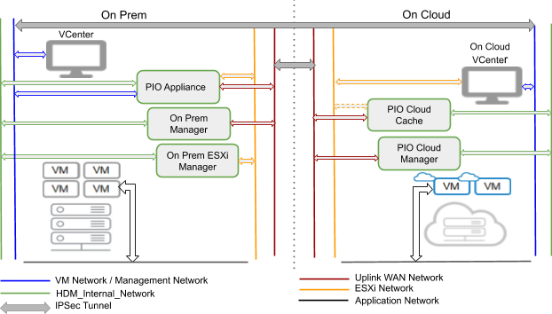
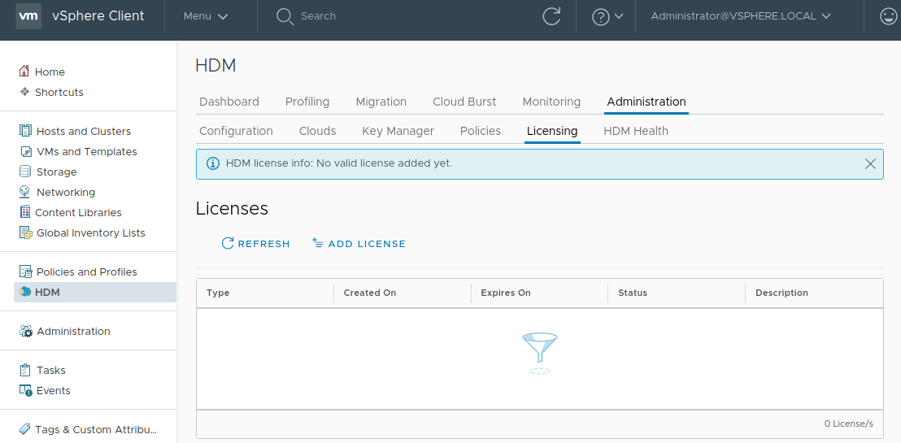
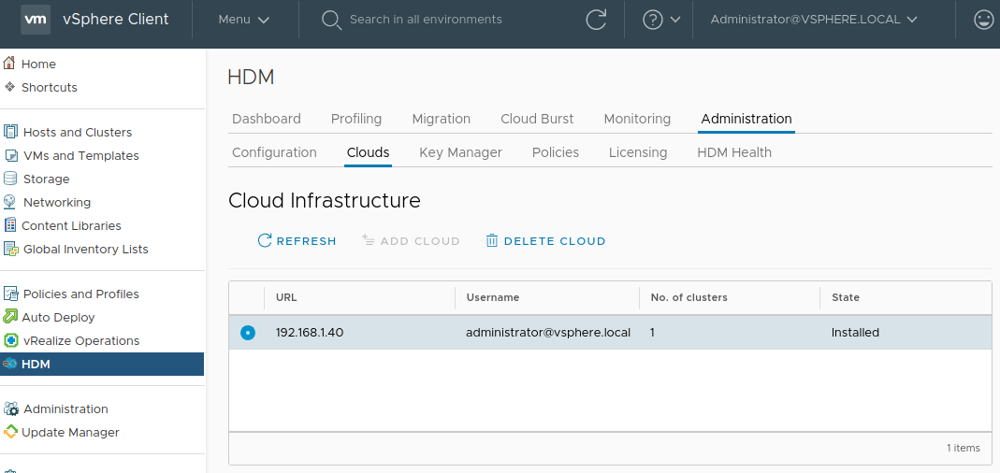
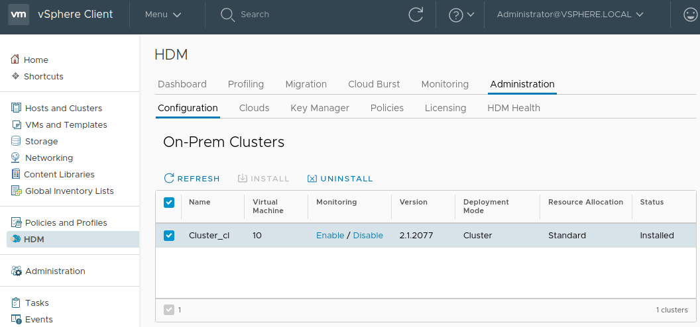

<!-- Copy and paste the converted output. -->

# 

# **HDM 2.1 for VMware**

# **Install Guide**

# About the HDM Install Guide

The HDM install guide describes how to deploy, configure and undeploy PrimaryIO’s Hybrid Data Management(HDM) for enabling migrations of virtual machines to the On-Cloud.

## Intended Audience

This document is intended for administrators looking for virtual machine migration to On-Cloud. HDM is designed to address faster migrations to the On-Cloud with minimal data transfer..

## **HDM 2.1 Software Package**

HDM is delivered as a virtual/software solution; when HDM software is installed, it consists of a single virtual appliance from where further deployment of HDM components happen on the On-Premise and on On-Cloud vCenters.

HDM package can be downloaded from [http://release.primaryio.com/vmware/HDM_2.1/](http://release.primaryio.com/vmware/HDM_2.1/2.1.2077/)

 HDM package would contain:

1. HDM_2.1 zip - The zip will contain the HDM appliance OVF
2. VCF - Contains documents for HDM deployment and management on VCF
    1. HDM 2.1 Install Guide - VCF.pdf
    2. HDM 2.1 Admin Guide - VCF.pdf
    3. HDM 2.1 Troubleshooting Guide - VCF.pdf
    4. HDM 2.1 Release Notes - VCF.pdf
    5. HDM 2.1 Deployment Checklist - VCF.pdf

# HDM Terminology

This document uses the below terms and terminologies at multiple places.

*   **PrimaryIO or PIO** 

    PIO is often used for PrimaryIO in this document.

*   **HDM**

    Hybrid data management solution from PrimaryIO

*   **Onprem or On-Prem  or On-Premise or source**

    Refers to On-Premise datacenter.

*   **Oncloud or On-Cloud or target**

    Refers to the On-Cloud infrastructure created in connection with the migration of an On-Premise VM.

*   **Appliance or PIO Appliance or HDM Appliance**

    The HDM Appliance VM deployed on the On-Premise vCenter

*   **Agile Rapid Migration or ARM**

    A migration type supported by HDM in which a VM and its data is moved to On-Cloud completely.

*   **Cold migration**

    A migration type supported by HDM, where the VM being migrated is powered off and its data is moved to the On-Cloud either online through HDM or offline through external sources.

*   **Warm migration**

    An migration type supported by HDM where the VM’s compute is migrated to the On-Cloud early and its data set is moved online through HDM or offline through external software in the background.

*   **Compute migration**

    This refers to the VM migrated to the On-Cloud while it continues to access its data On-Premise.

*   **Migrate time snapshot**

    HDM created snapshot of the VM just before migrating it to On-Cloud. This is useful in restoring the VM in case of failures and data consistency issues with migrated VM.

*   **Cloud Burst**

    A VM migration use case supported by HDM in which a VM is migrated to the On-Cloud temporarily due to high resource usage On-Premise.

*   **Try Before Commit**

    A VM migration use case to test whether VMs in On-Cloud perform good enough, before deciding whether to migrate VM’s entire data set. 

*   **SPBM or Storage Policy Based Management**

    Vmware provided mechanism to define storage policies that can be applied to individual VMs.

*   **Bulk migration**

    Background** **movement of the VM data in case of ARM use case. It is said to be **online **if the transfer is done by HDM and is **offline **if third party mechanism like AWS snowball is used.

*   **Ultra Lite, Lite, Standard or Performance Deployment**

    Type of deployment based on the resource allocation. Lite has least requirements and performance has maximum. 

*   **Standalone or Cluster Deployment**

    Mode of deployment based on the scale and fault tolerance requirements. Standalone has a fixed scale while cluster deployment scales with the number of nodes in the cluster.

# HDM Introduction

## Compute and Data De-Coupling

HDM decouples compute (Virtual Machines - VM) and storage (Virtual Disks - VMDK) functions to move

workloads to public clouds faster and more efficiently. Existing solutions require the full replication of data to the On-Cloud, and the loss of enterprise data control is a major concern. By contrast, HDM identifies the frequently used data (hot dataset) and moves only the minimal hot data to the On-Cloud to bring up workloads within minutes.

## HDM Use Cases

1. Agile Rapid Migration : The capability to decouple compute from data, makes HDM a powerful virtual machine migration tool with minimal downtime requirements. 
2. Try Before Commit : The ability to quickly test the VMs running On-Cloud, before fully committing to On-Cloud.

Details on how to operate HDM for these use cases are explained in later sections.

## HDM Components

HDM consists of several components with presence in both On-Cloud and On-Premise data centers. These components are microservices packaged as VMs that work together to provide the data and control path necessary for its use cases. It also provides a flexible deployment model and failure resilience.

Below is a pictorial representation of the components that constitute the HDM solution.

1. **PIO Plugin **PrimaryIO plug-in registered and installed on VMware vCenter for HDM management.
2. **PIO Manager** The main controlling appliance. This controls and orchestrates the entire system.
3. **PIO Filter **A** **VMware VAIO filter framework to gather I/O traces from each VM.
4. **PIO Analyzer** The I/O Analyzer (IOA) aggregates I/O traces from all VMs. It analyzes the I/O traces at a block level to make recommendations on the cloud cache requirements etc.
5. **Storage Gateway:** Provides access across the WAN link to ensure traffic optimization and redundancy against failures. It also accesses and manage the On-Premise VMDKs for remote VMs that are in the On-Cloud.
6. **Cloud Storage G/W: **The gateway for the VMs in the On-Cloud for reads and writes back to the On-Premise across the WAN link. It is possible to have multiple gateways across WAN link for redundancy.
7. **Cloud Cache: **The cloud cache is a fast, reliable, persistent cache for the VMs in the On-Cloud. The cache maintains the working set of the VMs, so that VMs can run efficiently without moving entire data On-Cloud. When there is a cache miss, it is fetched from the On-Premise side by requesting the storage gateway to get blocks from the On-Premise VMDK.

      

# 

### System Requirements

Following are the system requirements for HDM deployment

**Note**: Currently, HDM supports deployment for migration for only one cluster per vCenter at a time. If the VMs are to be migrated from multiple clusters, the process of deploy, migrate, undeploy would have to repeat for multiple clusters.

#### On-Premise Requirements

*   VMware Environment
    *   PrimaryIO HDM only supports a single version of ESX throughout the vCenter cluster. Currently, clusters with ESX 6.5U2+ and 6.7 are supported.
*   vCenter Web Client: 6.5 or 6.7 
    *   Please note that deployment of ovf from vCenter web client is the only supported Installation method.
    *   Using HTML client is recommended with Chrome v.75 +
*   PIO Appliance should be deployed on the same vCenter and datacenter which it would be managing. Recommendation is to deploy on a cluster not identified for migration.
*   PIO Appliance sizing: refer to HDM Resource Requirements section for appropriately sizing the PIO Appliance.
*   Datastore should be one of: VMFS, NFS, NFSv3.
*   HDM components should be deployed on Shared Datastore.
*   DRS and HA should be enabled on the vCenter cluster.
*   E1000E and VMXNet3 network adapter should be available in On-Premise vCenter.
*   Hardware Environment
    *   Network: >= 1 Gbps..
*   Network requirement:
    *   Create an On-Premise ON_PREM_HDM_NETWORK for HDM component interactions.
    *   10 Gbps link is preferred. Anything greater than 1 Gbps would work though.

        **Note**: Creating a new network as ON_PREM_HDM_NETWORK is not a mandatory step. You can configure HDM such that HDM traffic goes through the existing networks. However having a separate network is recommended for network isolation.  

    *   PrimaryIO Appliance should have access to following network:
        *   VM Network (Management Network) - To access and manage virtual machines on 6.x the vcenter.
        *   HDM_Internal_Network (HDM Internal Network) - For HDM component heartbeat and RTO/RPO data sync to On-Premise VMs
        *   Uplink_WAN_Network (WAN Network) - For connectivity to On-Cloud endpoint for HDM deployment and migration
        *   ESXi_Network (ESXi Network) - This usually maps to the VM network and provides access to ESXi. Required for IOA Analysis and data transfer.
        *   PrimaryIO Appliance should be accessible from ESXi servers of the cluster from which VMs will be migrated
        *   PrimaryIO Appliance should be accessible from ESXi.
    *   PrimaryIO Appliance should have access to On-Cloud vCenter and ESXi at port 443.
    *   ESXi, with multiple IP addresses should provide access to port 22 and 443 from all IPs of PIO Appliance.

    Related document: For hardware requirements and system requirements refer to the [VMware Hardware Compatibility List (HCL).](https://www.vmware.com/resources/compatibility/search.php)

**Note: VM Network (Management Network), HDM_Internal_Network (HDM Internal Network), Uplink_WAN_Network (WAN Network) and ESXi_Network (ESXi Network) can map to a single or more networks. **

In case a single network that provides all these functionality, customers would still need to provide details for each. Here, customers can divide the IP subnet into multiple ranges which can be mapped to these four networks. 

For example, for a network 192.168.1.0/24, we can have following IP ranges and can be used accordingly:

*   192.168.1.2 - 192.168.1.20 (VM Network)
*   192.168.1.21 - 192.168.1.40 (ESXi_Network)
*   192.168.1.41 - 192.168.1.60 (Uplink_WAN_Network)
*   192.168.1.61 - 192.168.1.80 (HDM_Internal_Networking)

#### On-Cloud Requirements

*   Supported On-Cloud endpoints:
    *   VMware Cloud on AWS
    *   IBM Cloud for VMware Solution
    *   VMware Cloud Foundation SDDC
*   HDM components should be deployed on Shared Datastore.
*   Network connectivity between On-Premise and On-Cloud
    *   Network Link >= 1 Gbps
    *   Network Round Trip Time Latencies: &lt; 30 ms
*   Network requirement:
    *   Create ON_CLOUD_HDM_NETWORK. All other On-Cloud HDM components should be deployed on this network. Recommeded 10 Gbps link. 

        **Note**: Creating new network as ON_CLOUD_HDM_NETWORK is not a mandatory step. You can configure HDM such that HDM traffic goes through the existing networks. However having a separate network is recommended for network isolation.

    *   On-Cloud HDM components should have access to WAN network.
    *   On-Cloud vcenter and esxi should be accessible from On-Premise at port 443.
    *   E1000E and VMXNet3 network adapter should be available in On-Cloud vCenter.
    *   ON_CLOUD_PIO_NETWORK or WAN network  on which HDM components are deployed should have access to On-Cloud vCenter at port 443 and On-Cloud ESXi at port 443 and 902.
    *   Firewall Rules for On-Cloud access for HDM:
        *   Port 22 - inbound and outbound
        *   Port 2379 - inbound and outbound
        *   Port 443 - inbound and outbound 
        *   Port 6000-6010 - inbound and outbound
        *   Port 7000-7010 - inbound and outbound
        *   Port 8000-8010 - inbound and outbound
        *   Post 32820 - inbound and outbound

#### OS Requirements

HDM deployment is for migration of VMs to On-Cloud. HDM supports the following OS types and versions for migration. Ensure that the VMs you are looking for migration using HDM, is one of these types :

**Windows**

<table>
  <tr>
   <td><strong>Windows Version</strong>
   </td>
   <td><strong>Edition</strong>
   </td>
  </tr>
  <tr>
   <td>Windows Server 2012 R2 (64 bit)
   </td>
   <td>Standard
   </td>
  </tr>
  <tr>
   <td>Windows Server 2016 (64 bit)
   </td>
   <td>Standard
   </td>
  </tr>
  <tr>
   <td>Windows Server 2019 (64 bit)
   </td>
   <td>Standard
   </td>
  </tr>
</table>

**Linux**

<table>
  <tr>
   <td><strong>Linux Distributions</strong>
   </td>
   <td><strong>Version</strong>
   </td>
  </tr>
  <tr>
   <td>RHEL
   </td>
   <td>6.9, 6.10, 7.2, 7.3, 7.4, 7.5, 7.6
   </td>
  </tr>
  <tr>
   <td>SLES
   </td>
   <td>12-SP4
   </td>
  </tr>
  <tr>
   <td>CentOS
   </td>
   <td>7.6 (1810), 7.5 (1804), 7.4 (1708)
   </td>
  </tr>
  <tr>
   <td>Ubuntu Server	
   </td>
   <td>16.04, 18.04
   </td>
  </tr>
</table>

### HDM Deployment

HDM provides a very flexible deployment model providing options to be able to cater to different user needs in terms of use case, performance, scalability and security. This needs to be selected as part of installation of on-premise components. 

#### HDM Deployment Types

While deploying HDM users need to select a combination of **Deployment Mode** and **Resource Allocation **type. The features of the available options are provided below to guide the user to  choose the deployment type that is best suited for his / requirements. HDM deployed components. 

#### Deployment Mode : Standalone or Cluster

Based on the scale and failure tolerance requirements,  users can choose the standalone or cluster modes of deployment. Please note the following points:

1. In the standalone mode, a fixed number of HDM components are installed irrespective of the size of the cluster. Also, in this mode, there is no redundancy in the HDM components, which means less fault tolerance.
2. In the cluster mode, some of the HDM components are installed according to the scale of the cluster for a higher redundancy and better failure tolerance. This means more resource consumption as compared to the standalone option. Number of concurrent migrations is also higher than the standalone option. 

#### Concurrency and Scale Support 

Below table depicts the concurrency and scale support in various HDM deployment types

**Note: **Here, the N in Cluster (N) refers to the number of nodes in the On-Cloud cluster where HDM is deployed.

<table>
  <tr>
   <td>
   </td>
   <td><strong>Concurrent</strong>

<strong>Cold Migrations</strong>
   </td>
   <td><strong>Compute</strong>

<strong>Migrated VMs</strong>

<strong>On-Cloud</strong>
   </td>
   <td><strong>Concurrent</strong>

<strong>Warm Migrations</strong>
   </td>
  </tr>
  <tr>
   <td><strong>Lite</strong>
   </td>
   <td>
   </td>
   <td>
   </td>
   <td>
   </td>
  </tr>
  <tr>
   <td>Standalone
   </td>
   <td>8
   </td>
   <td>10
   </td>
   <td>2
   </td>
  </tr>
  <tr>
   <td>Cluster (N)
   </td>
   <td>8
   </td>
   <td>2 x 10
   </td>
   <td>N x 2
   </td>
  </tr>
  <tr>
   <td><strong>Standard</strong>
   </td>
   <td>
   </td>
   <td>
   </td>
   <td>
   </td>
  </tr>
  <tr>
   <td>Standalone
   </td>
   <td>8
   </td>
   <td>20
   </td>
   <td>4
   </td>
  </tr>
  <tr>
   <td>Cluster (N)
   </td>
   <td>8
   </td>
   <td>N x 20
   </td>
   <td>N x 4
   </td>
  </tr>
  <tr>
   <td><strong>Performance</strong>
   </td>
   <td>
   </td>
   <td>
   </td>
   <td>
   </td>
  </tr>
  <tr>
   <td>Standalone
   </td>
   <td>8
   </td>
   <td>25
   </td>
   <td>8
   </td>
  </tr>
  <tr>
   <td>Cluster (N)
   </td>
   <td>8
   </td>
   <td>N x 25
   </td>
   <td>N x 8
   </td>
  </tr>
</table>

Note : In Ultra Lite mode HDM can process multiple requests for migration at a time. The requests will be queued by the system. The system will analyse the virtual machines and process 8 VMDKs at a time per node of the cluster. 

#### Resource Allocation : Ultra Lite, Lite, Standard or Performance

HDM provides the Ultra LIte, Lite, Standard or Performance resource allocation options of deployment. Trade off is mainly in terms of CPU and memory resource utilization vs the capacity for the number of concurrent migrations. Few points to remember:

1. Ultra Lite is less resource intensive and supports cold migration using PIO’s proprietary data transport. 
2. Lite mode is least resource intensive among other options. The parallelism of migration as well as the number of concurrently migrated VMs is limited here.
3. Standard mode is more scalable as compared to Lite mode and less than the Performance mode, resource requirement is higher in a similar proportion.. 
4. Performance mode has the highest resource requirement,  it provides the highest performance in terms of maximum parallelism during migration as well as number of migrated VMs On-Cloud.

#### HDM Resource Requirements

Below table depicts the resources required for different deployment types.

**Note**: 

1. Here the names ESXMgr, CloudCache, PremMgr and CloudMgr are abbreviated names of the VMs containing HDM components. These get created as part of the HDM deployment
2. **T**he N in Cluster (N) refers to the number of nodes in the On-Cloud cluster.

<table>
  <tr>
   <td>
<em> </em>
   </td>
   <td><strong>Standalone</strong>
   </td>
   <td><strong>Cluster (N)</strong>
   </td>
  </tr>
  <tr>
   <td><strong>Ultra Lite</strong>
   </td>
   <td>
   </td>
   <td>
   </td>
  </tr>
  <tr>
   <td>On-Premise
   </td>
   <td><strong>1</strong> Appliance (4 vCPU, 8 GB RAM, 144 GB disk)

<strong>1</strong> ESXMgr (4 vCPU, 4 GB RAM, 128 GB disk)
   </td>
   <td>1 Appliance (4 vCPU, 8 GB RAM, 144 GB disk)

2 ESXMgr (4 vCPU, 4 GB RAM, 128 GB disk)
   </td>
  </tr>
  <tr>
   <td>On-Cloud
   </td>
   <td><strong>1</strong> CloudCache (6 vCPU, 5 GB RAM, 64 GB disk)
   </td>
   <td>2 CloudCache (6 vCPU, 5 GB RAM, 64 GB disk)
   </td>
  </tr>
  <tr>
   <td><strong>Lite</strong>
   </td>
   <td>
   </td>
   <td>
   </td>
  </tr>
  <tr>
   <td>On-Premise
   </td>
   <td><strong>1</strong> Appliance (4 vCPU, 8 GB RAM, 144 GB disk), \
<strong>1</strong> ESXMgr (4 vCPU, 4 GB RAM, 96 GB disk)
   </td>
   <td><strong>1 </strong>Appliance \
<strong>2</strong> ESXMgr
   </td>
  </tr>
  <tr>
   <td>On-Cloud
   </td>
   <td><strong>1</strong> CloudCache (6 vCPU, 12 GB RAM, 32 GB disk, 512 GB cache)
   </td>
   <td><strong>2</strong> CloudCache
   </td>
  </tr>
  <tr>
   <td><strong>Standard</strong>
   </td>
   <td>
   </td>
   <td>
   </td>
  </tr>
  <tr>
   <td>On-Premise
   </td>
   <td><strong>1</strong> Appliance (4 vCPU, 8 GB RAM, 144 GB disk), \
<strong>1</strong> PremMgr (3 vCPU, 4 GB RAM, 32 GB disk),

<strong>1</strong> ESXMgr (4 vCPU, 4GB RAM, 160 GB disk)
   </td>
   <td><strong>1</strong> Appliance

<strong>2</strong> PremMgr, 

<strong>N</strong> ESXMgr
   </td>
  </tr>
  <tr>
   <td>On-Cloud
   </td>
   <td><strong>1 </strong>CloudMgr (4 vCPU, 6 GB RAM, 32 GB disk), \
<strong>1</strong> CloudCache (6 vCPU, 20 GB RAM, 32 GB disk, 512 GB cache)
   </td>
   <td><strong>2</strong> CloudMgr, \
<strong>N</strong> CloudCache
   </td>
  </tr>
  <tr>
   <td><strong>Performance</strong>
   </td>
   <td>
   </td>
   <td>
   </td>
  </tr>
  <tr>
   <td>On-Premise
   </td>
   <td><strong>1</strong> Appliance (4 vCPU, 8 GB RAM, 144 GB disk) \
<strong>1</strong> PremMgr (3 vCPU, 4 GB RAM, 32 GB disk),

<strong>1</strong> ESXMgr (5 vCPU, 9 GB RAM, 288 GB disk)
   </td>
   <td><strong>1</strong> Appliance \
<strong>2</strong> PremMgr,

<strong>N</strong> ESXMgr
   </td>
  </tr>
  <tr>
   <td>On-Cloud
   </td>
   <td><strong>1</strong> CloudMgr (6 vCPU, 6 GB RAM, 32 GB disk), \
<strong>1</strong> CloudCache (8 vCPU, 40 GB RAM, 32 GB disk, 2 TB cache)
   </td>
   <td><strong>2</strong> CloudMgr, \
<strong>N</strong> CloudCache
   </td>
  </tr>
</table>

**Recommendation**: It is recommended to use the Standard-Standalone mode for test purposes and any of the Cluster modes for production purposes. 

### **Network Topology **

This needs to be planned well because the HDM components are configured in a certain way within the network. Choice of network topology also matters for VMs to be migrated. It is based on the network security and isolation requirements for the VM once it migrates to the On-Cloud. 

HDM provides the following flexibility for the network configuration:

1. Choice of the networks that HDM components should use
2. Choice of IP type for HDM components

#### **Network Types**

An ideal network configuration provides for isolation between types of network traffic, for maximum security, performance and access control. HDM assumes there could be following types of networks in the environment:

1. Management Network (VM Network) : This usually maps to the VM network and provides access to vCenter. All management API communication with vCenter happens over this network.
2. ESXi Network (ESXi_Network): This usually maps to the VM network and provides access to ESXi.
3. HDM Internal Network (HDM_Internal_Network) : This network is used by HDM for communication among its components. It is recommended to have a dedicated low latency network be configured for this purpose. Depicted in image below as PIO OnPrem Network on On-Premise and PIO Cloud Network on On-Cloud.
4. WAN Network (Uplink_WAN_Network) - This network provides access to the cloud. All data transfer to and from premise to cloud happens over this network. This could be a public link or direct connection between On-Premise and On-Cloud.
5. Application Network : This network is used for data transfer by the Application VMs and each application can be accessed on its own network. So, a large number of application networks are possible. 

#### HDM Networking for Production : Multiple Network Topology

The different network selection and their usage by HDM components is depicted below:

During deployment, HDM components are configured such that the requirements for network access to necessary data stores, networks and communication with other components are met. For example, HDM doesn’t require access to application networks and so HDM components are not configured to access them. 

During HDM deployment, users are required to categorise and map and the networks discovered in the vCenter as per the types mentioned above. 

**Note: **In an ideal case, different traffic should use different network type. However, a user may have one or multiple types of traffic using the same network. This is deemed as a valid configuration and supported by HDM.

#### HDM Networking for Test : Single Network Topology

While HDM deployment has the flexibility of supporting separation of network traffic as mentioned in the previous section, for test purposes, HDM can also be deployed in test environments where there may not be separation between all the types of networks mentioned above. In such situations, the network configuration would be simplified as shown below : 

In this case all of the “Source Networks” would map to VM Network / Management Network during the deployment process as shown below. 

#### IP Allocation

HDM supports both DHCP or static IP for its components. At deployment time, the user is asked with this choice.For static IPs, IP allocation range also has to be provided. Minimum IPs required can vary with the number of nodes in the cluster and the deployment mode chosen. 

**Note**: HDM does not support the change of IP of its components (Appliance as well as other component VMs). If you wish to change the IP of any HDM component, you need to redeploy the HDM.

## Deployment Checklist

To help user perform the deployment, the document **HDM 2.1 Deployment Checklist - VCF.pdf **is present in the HDM package. User can fill the checklist and make sure that all the required information is there while starting the deployment. 

## HDM Deployment Steps

HDM deployment involves the following steps:

1. Deploy HDM Appliance on On-Premise
2. Add On-Premise vCenter to the Appliance
3. Register HDM Plugin to On-Premise vCenter
4. Add HDM License
5. Deploy HDM On-Premise
6. Deploy HDM On-Cloud

### Step 1/6  : Deploy HDM Appliance 

HDM Appliance manages both On-Premise and On-Cloud HDM operations. This section covers the following topics for deployment and configuration of HDM Appliance, please follow the instructions carefully:

1. Placement of the HDM Appliance on On-Premise
2. System Requirements for the Appliance 
3. Network Requirements
4. Deployment and configuration
5. Network Configuration for the Appliance
6. Adding the vCentre

#### Placement of HDM Appliance

1. It must be deployed on the same On-Premise vCenter which it needs to manage.
2. It should ideally be kept in a separate cluster than the one it is supposed to manage.

#### Deployment and Configuration

HDM Appliance is deployed from the OVF shipped as part of the HDM package. Please ensure that the placement and sizing of the deployment conforms to the requirements mentioned above.

Use the **Deploy OVF Template **option in vCenter to deploy the Appliance as shown below:

#### Network Configuration

Appliance network configuration requires the user to specify the available networks into 4 categories as described in the network requirements section and HDM Resource Requirements sections above.

In the simplest case, these networks can point to the same network. But best practice is to have them separate.

Also, it should be specified whether the Appliance should have static IP or DHCP.

#### IP Address Details

For all the 4 categories of network, choose the IP allocation mechanism : static or DHCP.

For static IP, following details are also required 

*   IP range : IP list that are free to be allocated for 
*   Subnet mask : subnet of the IP range
*   Gateway : gateway IP of the network
*   Domain : domain name of the network
*   DNS : to translate the domain name to IP
*   NTP : for time sync

Networks with DHCP, can skip this configuration.

**Note**: 

1. NTP server must be specified for static IP configuration. Not providing this input may cause a lot of further HDM operations to fail.
2. In case of static IP, gateway IP and the IP range specified should be in the same subnet.

#### Power on the Appliance

Go through the rest of the wizard and wait for the deployment to complete. Once the deployment is done, power on the Appliance from the vCenter.

#### Enable VMware HA on the Appliance

(_This step should be performed only for Cluster mode deployments of HDM_)

vmware HA should be enabled on the cluster on which Appliance has been deployed. For this, follow the below procedure

1. In the On-Premise vCenter, select the cluster on which Appliance is deployed
2. On the right hand pane, click on Configure tab and go to Services -> vSphere Availability
3. If the vSphere HA is Turned OFF, click on EDIT and enable vSphere HA

### Step 2/6 : Add On-Premise vCenter to the HDM Appliance

**Note**: The On-Premise vCenter to be added should be the same as where the HDM Appliance is deployed. 

Pre-requisites

1. Ensure that HDM Appliance is powered on and you have valid vCenter administrator credentials.

Steps

1. Log into the _PIO Appliance_ by accessing _https://&lt;appliance ip>_ in a supported web browser and entering the administrator credentials. The default administrator username and password are _‘administrator’_ and _‘admin@123’_ respectively. Users are recommended to change the default password after the first login.
2. Click on **vCenters** in the top pane.
3. Click on **Add vCenter** at the top right.

4. Specify the On-Premise vCenter IP or FQDN by which the vCenter is configured while its installation along with administrator credentials and click **Add vCenter**.
5. You should see the PIO Appliance now listing the On-Premise vCenter

### Step 3/6 : Register HDM Plugin to vCenter

6. Click on **Register **to register the HDM plugin to On-Premise vCenter.
7. Logout and login twice(and sometimes more) from the vCenter for the plug-in installation to complete. Successful installation should add a HDM icon in the vCenter home page.

    **Note:  The PrimaryIO vCenter plugin will be automatically registered on all vCenters that are configured in _enhanced linked mode_. **

### Step 4/6 : Add HDM License

For HDM deployment a license key is required to activate the product.  A trial license will be shared with the product which can be used to activate HDM. 

**Note**: Loading the HDM configuration page may take a few mins to load as product settings need to be initialised. 

Steps to add license:

1. In the On-Premise vCenter, click on PrimaryIO from Shortcuts or from Menu to access the PrimaryIO dashboard
2. Select **Administration **from the tab
3. Click on **License** to, add or list existing license.
4. Click on **Add License **to open a popup where the given **Trial license** can be pasted. 

5. Copy and paste shared license key and click on **OK**.

6. Once the license has been added, it will be listed on the licence page.
7. The same interface can then be used to add **Product License**.

### Step 5/6 : Deploy HDM On-Premise

This section covers the steps for completing the deployment of HDM On-Premise. The topics covered in this section are as follows:

1. Select a cluster for HDM deployment 
2. Select HDM deployment mode
3. Select HDM resource allocation
4. Network configuration 
5. Complete the deployment

On-Premise deployment may take anywhere between 10-20 mins depending on the network bandwidth and storage. Any failure-retries done by product during the deployment process are logged into vCenter events. **hdm** or **com.primaryio** keyword can be used in vCenter event search to search for events generated by HDM.

Pre-requisites 

It is assumed that the HDM Appliance deployment and configuration has been executed successfully. Ensure that Plugin has been registered on vCenter and HDM icon is visible in the vCenter home screen. A valid HDM license has been added to activate the product.

Steps for deployment

1. In the On-Premise vCenter, click on PrimaryIO from Shortcuts or from Menu to access the PrimaryIO dashboard
2. Select **Administration **from the tab
3. Click on **Configuration** to access the On-Premise cluster listing. 

4. Select a cluster on which the HDM product should get installed. And then click on **Install**.
    1. This will open a wizard to select resources for HDM component deployment.
5. Verify that the Appliance IP is correct. 
6. Select deployment mode based on the scale and failure tolerance requirements On-Premise and on On-Cloud. See section Deployment Requirements for details on different deployment mode.
7. Select resource allocation based on size and resource requirements. See section Deployment Requirements for details on different allocation types.

8. Select resource pool and shared datastore where HDM components should be deployed.

PS: Make sure enough resources are available on On-Premise and on On-Cloud  when selecting deployment modes. 

9. Specify Network Configurations

    Administrator can either use DHCP or Static for IP address allocation. For static IP address allocation, administrator would need to specify unused IP address or IP ranges along with gateway, subnet mask, domain search path along with one or more DNS and NTP server.  More details on these inputs are present in Deployment Requirements section. Administrator will have to repeat the steps for:

1. HDM Internal Network (HDM_Internal_Network)
2. WAN Network (Uplink_WAN_Network)
3. ESXi Network (ESXi_Network)

**Note:  **
1. **If all are mapping to single network, separate IP ranges will still need to be provided for each of the network type.**
2. **The subnet range 172.17.0.0/16 is not available for the deployment; it is internally used by HDM microservices.**

10. Confirm the selection and submit the Installation request by clicking on FINISH button.

11. This will create a deployment task which can be monitored from vcenter tasks. Also, the deployment progress can be seen in the HDM configuration view:

2. Wait for the deployment task to finish.

## 

### Step 6/6 : Deploy HDM On-Cloud

This section covers the steps for deployment of HDM On-Cloud; it assumes that the deployment of HDM On-Premise has been executed successfully. 

The topics covered in this section are as follows:

1. Prerequisites for On-Cloud deployment
2. Add a Cloud
3. Select Cluster, resource pool, data store for HDM
4. Network Configuration - multiple networks to be configured 
5. Finish deployment

Add On-Cloud may take anywhere between 20-30 mins depending on the WAN bandwidth and WAN latency. Any failure-retries done by product during the deployment process are logged into vCenter events. **hdm** or **com.hdm** keyword can be used in vCenter event search to search for events generated by HDM.

Pre-requisites 

1. Ensure that HDM Plugin has been registered on vCenter and HDM icon is visible on the home screen. 
2. Ensure On-Premise deployment is done successfully.
3. Ensure that vCenter On-Cloud is reachable from HDM Appliance. If On-Cloud vCenter is on WAN network and WAN network is not reachable through the Appliance’s default route, then a static entry needs to be added on the HDM Appliance to reach the On-Cloud vCenter. This can be done through the following steps
    1. vim /etc/pio.routes and add the entry `ens256|&lt;cloud_subnet>|&lt;gateway_to_access_cloud>`

        Example:  ens256|10.3.0.0/24|10.1.0.1

    2. /usr/bin/setup/network.sh

Steps for deployment

1. In the On-Premise vCenter, click on HDM from Shortcuts or from Menu to access the HDM dashboard
2. Select **Administration **from the tab
3. Click on **Clouds** to access the On-Cloud listing

4. Click on **Add Cloud**
    1. This will open a wizard to select resources for HDM component deployment.
5. Select the On-Cloud type and enter On-Cloud credentials and the On-Cloud DNS. 

    **Note**: In current release, the On-Cloud type is just notional, deployment doesn’t change based  On-Cloud type selection.

6. Select cluster, resource pool,  datastore and VM folder On-Cloud where HDM component should be deployed. 

    **Note**: Select shared datastore On-Cloud when deploying HDM component.

7. Select network and IP configuration for ON_CLOUD_HDM_NETWORK, which will be used by HDM to do the VM boot and subsequent IO handling through the HDM components.

    Administrator can either use DHCP or Static for IP address allocation. For static IP address allocation, administrator would need to specify unused IP address or IP ranges along with gateway, subnet mask, domain search path along with one or more DNS and NTP server.

8. Select network IP configurations for WAN 

    Administrator can either use DHCP or Static for IP address allocation. For static IP address allocation, administrator would need to specify unused IP address or IP ranges along with gateway, subnet mask, domain search path along with one or more DNS and NTP server. 

9. Set WAN route configuration so that data traffic from On-Cloud to On-Premise is possible. See Deployment Requirements section for details.

10. If you have warm migration use case, you should set routing rules to access On-Cloud vCenter on port 443 and ESXi on port 443 and 902. Also need to specify which network out of HDM Internal Network or WAN Network be used for routing.

11. Select network mapping so that the network categorization done On-Premise gets percolated to On-Cloud 

12. Confirm the selection and click on **Finish **to submit the request.

13. This will create deployment tasks for On-Cloud components deployment. The task can be monitored in vCenter Tasks. Also, the progress can be seen in HDM configuration view. 

14. Wait for the deployment task to finish.

## DNS Entry to resolve FQDN

In case On-Cloud vCenter or ESX has been added with FQDN, the user should add the DNS nameserver in HDM cloud cache component explicitly, using the following procedure:

1. Login to the On-Cloud vCenter
2. User should find HDM cloud cache component VMs with name ‘HDM-Cloud-Cache-*’.
3. ssh into each HDM cloud cache component VM with root credentials and password ‘admin123’
4. Set the DNS server in /`etc/resolv.conf` required for resolving the FQDN
5. Ensure FQDN is reachable using ping command

## Deployment Validation

Once the deployment On-Premise and On-Cloud is complete, we have few ways to view the deployed components and their states.

### Appliance View

After successful installation of HDM On-Cloud, the Appliance control panel shows the list of components and their health. 

Figure: HDM components after the deployment

In addition to the Appliance Control Panel this information is also available on vCenter on the HDM plugin.

Menu > HDM > Administration > HDM Health > Component Health

### On-Premise vCenter

After successful On-Cloud deployment, the On-Premise vCenter should show the On-Cloud state as installed in the PrimaryIO -> Administration -> Clouds view. 

## Enable IO Monitoring

**Notes**: 

1. This step is not required for cold migration.
2. For Lite standalone and Lite cluster deployment modes, this step only creates the SPBM policy and attaches to VMs in the cluster, but doesn’t do detailed IO profiling.

HDM requires the VMs On-Premise to be monitored for IO by HDM. Monitoring helps in 

1. Estimating the cloud cache size requirement for a given VM 
2. Whether the VM is a suitable candidate for  migration

This is done by creating HDM SPBM policy of cache type and applying that policy to the existing VMs. Detailed steps are given below:

Pre-requisites 

1. Ensure On-Premise installation is done successfully.
2. Ensure that there is no HDM SPBM policy named ‘HDM Analyzer Profile’ already existing from previous attempts of HDM installations. This can be done using below steps
    1. In the On-Premise vCenter, go to Home -> Policies and Profiles -> VM Storage Policies
    2. If you see ‘HDM Analyzer Profile’, delete it

Steps

1. In the On-Premise vCenter, click on PrimaryIO from Shortcuts or from Menu to access the PrimaryIO dashboard
2. Select **Administration **from the tab
3. Click on **Configuration** to access the cluster listing.
4. Against the cluster on which HDM is installed, click on **Enable** under monitoring. This will open a popup.

5. Click on **OK **to enable monitoring.

This will create a _‘SPBM _policy of cache type for HDM. The default name for the policy is **HDM Analyzer Profile. **You can view this profile in the On-Premise vCenter at:

Home -> Policies and Profiles -> VM Storage Policies

This newly created HDM  policy is applied to all the virtual machines under the cluster and monitoring for IO activity gets enabled.  For each virtual machine a reconfiguration task will be generated when applying HDM SPBM policy. If VMs have been successfully reconfigured, VM policies for these virtual machine would have **‘HDM Analyzer Profile’** applied against each of their VMDKs.**  **

Once the policy has been applied, the user can check  analyzer summaries by selecting **VM->Monitoring->PrimaryIO** from **Host and Clusters** view.

**Note**: 

1. You can execute Enable IO Monitoring step any number of times to enable monitoring for new VMs, since last execution.
2. Applying SPBM policy can fail for some VMs. For example, when the VM already has a snapshot. This doesn’t fail the entire operation.

### Disabling Monitoring on a VM

**Note**:** this step must not be executed for a VM if you expect the VM to be migrated to On-Cloud**.

The monitoring of a VM is a low overhead activity and is done transparently without affecting the ongoing IOs or operation. Still, if in case the user doesn’t want HDM to monitor certain VMs, the following are the steps to be executed. 

Steps

1. In the On-Premise vCenter, right click on the VM you do not want to be monitored.
2. Select VM Policies -> Edit VM Storage Policies
3. In the popup, if the VM storage policy is HDM Analyzer Profile, then select VM storage policy as **Datastore Default **and click on **Apply to all**

4. The vCenter task will display the operation progress and status.

**Note**: HDM can’t migrate a VM, if it doesn’t have HDM SPBM policy. You can at any time apply the SPBM policy to a VM for making it available for migration.

# HDM SQS Configuration

HDM is integrated with SQS (Simple Queue Service from AWS) message bus.  HDM **_sqs-python_** is a python based library that provides an interface to manage and operate the HDM product. 

**Client Application** : Clients will be written by a third party and will use the sqs-python library to send HDM command messages and receive responses.

**SQS Messaging Service** :  Its role is to receive command requests from the client and pass on to the HDM. The responses are received from HDM and passed on to the client.

**HDM** : HDM acts as the server of the commands and sends responses. In addition there is also a periodic heartbeat that happens between HDM and client, so that client is aware of the system state of the server.

For third party integration to work, the HDM appliance after the deployment must be configured with the message bus. After this step, HDM will listen and execute operations posted on this bus and send back the status of these operations to the caller. 

Pre-requisites

1. HDM Appliance must be installed before the configuration of HDM SQS.
2. No other step in the HDM deployment should have been performed at this point.
3. User should be ready with the SQS message bus token to be used for the configuration

Steps

1. Access PrimaryIO Appliance on browser.
2. Log into the Appliance using the Administrator credentials.
3. Go to the vCenters page. Then click on the user profile icon

4. Click on **Configure Message Bus.**
5. Provide the SQS message bus token of the third party in the pop-up and click on **Configure.** 

6. The configured message bus details can be seen. Once configured, to change the message bus configuration, click on **Reconfigure**.

**Note: PIO Appliance should have access to the Internet for warm or cold migration through SQS.**

# HDM Migrations

HDM is used to perform migration of VMs from On-Premise to On-Cloud. There are different use cases where 

HDM migrations are used. Detailed use cases and procedure for using HDM for migrate operations is explained in **HDM 2.1 Admin Guide.pdf.**

This document focuses on the deployment and undeployment aspects of the HDM.

# HDM Undeployment

## Steps for HDM Undeployment

HDM undeployment consists of the following high level tasks:

1. Undeploy HDM On-Cloud
2. Disable monitoring
3. Undeploy HDM On-Premise
4. Uninstall HDM filter from cluster
5. Unregister HDM vCenter plugin
6. Delete PrimaryIO Appliance from vCenter

## Undeploy HDM On-Cloud

Pre-requisites

1. Ensure all virtual machines have been migrated back to On-Premise. An indicator for this is the resource pool HDM_MIGRATE_POOL in On-Premise vCenter, which should be empty before the undeployment.

Steps

1. In the On-Premise vCenter, click on HDM from Shortcuts or from Menu to access the HDM dashboard
2. Select **Administration **from the tab
3. Click on **Clouds** to access the On-Cloud listing.
4. Select the On-Cloud from the listing and click on **DELETE CLOUD**

5. Click **OK** on the Delete OnCloud popup to start the undeployment.

6. This will create undeployment tasks for On-Cloud components. The task can be monitored in vCenter Tasks. Also, the progress can be seen in HDM clouds view.

7. Wait for the undeployment task to finish.

## Disable Monitoring

Pre-requisites

1. There must not be any VMs migrated to On-Cloud ie. the HDM_MIGRATE_POOL resource pool in On-Premise vCenter must be empty.

Steps

1. In the On-Premise vCenter, click on HDM from Shortcuts or from Menu to access the HDM dashboard
2. Select **Administration **from the tab
3. Click on **Configuration** to access the cluster listing
4. Against the cluster on which HDM is installed, click on **Disable** under monitoring

1. Click on OK in the popup that appears

1. For each VM a reconfiguration task in vCenter will be created when removing HDM SPBM policy as part of disabling the monitoring.

## Undeploy HDM On-Premise

Pre-requisites

1. Ensure On-Cloud undeploy completed successfully.
2. Ensure disable monitoring completed successfully.

Steps

1. In the On-Premise vCenter, click on HDM from Shortcuts or from Menu to access the HDM dashboard
2. Select **Administration **from the tab
3. Click on **Configuration** to access the cluster listing
4. Against the cluster on which HDM is installed, click on **UNINSTALL. **

5. Click on OK in the Uninstall OnPrem pop-up

6. This will create undeployment tasks for On-Premise components. The task can be monitored in vCenter Tasks. Also, the progress can be seen in HDM configuration view.

7. Wait for the undeployment task to finish.

## Uninstall HDM Filter from Cluster

**Note**: IO filter uninstallation requires ESXi on the On-Premise cluster to be put into maintenance mode. Please ensure that if the cluster has only one node, then all the VMs other than HDM Appliance are powered off.

Pre-requisites

1. HDM On-Premise undeployment must be successful

Steps

1. Access PrimaryIO Appliance on browser.
2. Log into Appliance using Administrator credentials.
3. Select tab vCenters to view the vcenter listing.
4. Against the vCenter, click on **Uninstall**.

5. A pop up will open which will guide the admin through uninstallation. Select the correct cluster on which the HDM was installed

6. This will create a task which can be monitored from vCenter tasks.
7. If your Appliance is also part of the cluster and the cluster has just 1 node, you should follow these additional steps
    *   You should power off all the guest VMs residing on that cluster.
    *   You should immediately go to the On-Premise vCenter and power off the Appliance VM, so that the cluster host can go in maintenance mode. You have to do it, before the task of uninstallation of VIB fails in the vCenter.
    *   Once the uninstall task completes successfully, power on the Appliance VM.
    *   After the Appliance VM is booted, re-trigger the uninstall from the Appliance. This time the uninstall should succeed without the power on-off requirement.
8. Wait for the uninstall task to finish, that can be seen on pop up.

## Unregister HDM vCenter Plugin

Unregistering the HDM plugin causes the HDM icon to get removed from the vCenter.

Pre-requisites

1. Uninstall of HDM filter must be complete.

Steps

1. Access PrimaryIO Appliance on browser.
2. Log into Appliance using Administrator credentials.
3. Select tab vCenters to view the vcenter listing.
4. Against the vCenter, click on **Unregister**

5. Once the unregister is successful, the HDM icon should not appear in the vCenter menu. However, to see this change, you must logout and login to the vCenter again.

## Delete PrimaryIO Appliance from vCenter

    Pre-requisites 

1. Ensure that HDM plugin has been unregistered.

Steps

1. Access PrimaryIO Appliance on browser.
2. Log into Appliance using Administrator credentials.
3. Select tab vCenters to view the vcenter listing.
4. Against the vCenter, click on **Delete**.

5. On the popup, click on **Yes **to delete the vCenter from the Appliance.
6. Log into vCenter.
7. From Host and Clusters, power off PrimaryIO Appliance VM.
8. Right click on the Appliance VM and select Delete from Disk to delete the Appliance.

# TroubleShooting

## HDM Support Logs

In case of an issue with HDM and to get support from the HDM team, it is necessary for the user to provide the following logs from the deployed system. 

1. HDM support logs
2. VMware support logs 

The logs collected should be provided to the HDM support along with the issue description. 

### Download HDM Logs

Pre-requisites

1. HDM Appliance should be in powered on state.

Steps for download

1. Log into the HDM Appliance by accessing **_https://&lt;appliance ip>_** in a supported web browser. 
2. In the top right corner, click on the user profile icon and choose Download Debug Logs option.

3. A zip file named **_pio_logs.zip_** having the HDM logs will be downloaded. This file can be sent as an attachment for further analysis of the issue.

### Download _VMware support_ logs

.

Steps:

1. Log into On-Premise vCenter from the vSphere web client. Right click on the vCenter IP and select the **Export System Logs** option  

2. In the **Select Hosts** page, select the hosts that are part of the cluster where HDM is installed. Also check the **Include vCenter and vSphere Web Client Logs** option.
3. Go through the rest of the wizard to generate a zip file containing the _VMware support_ logs from both vCenter and ESXi hosts.

## HDM Reset

**CAUTION: Use this functionality with caution and should only be used when the system has entered an unrecoverable state. There are chances of data loss. **

HDM Reset is used to come out of situations when HDM enters into unrecoverable state. It cleans all On-Cloud and On-Premise state, something equivalent to factory reset.

HDM Reset is usually followed by re-deployment of HDM as explained later.

### What HDM Reset Won’t Do

HDM reset is not about cleaning all the states. It only cleans states which are required to bring back the system in a state where we can again reinstall HDM.

1. Will not remove Storage policies.
2. VAIO component will not be removed from esxi. 
3. Will not uninstall or unregister vcenter plugin.

### When to Perform HDM Reset

Few cases where HDM Reset may be required are

*   **Multiple HDM components failing together** : HDM tries to recover from multiple component failures. But chances are this may require HDM reset.
*   **Prolonged WAN outages **:  HDM can handle transient network failure, but long outages (greater than 5 minutes), it may be unable to do the recovery.
*   **Component recovery failure for an extended period of time** : HDM attempts to recover the failed components a few times. If the failure condition does not disappear, it may cause the component recovery to always fail. This may be indicated by the Control Panel in the HDM Appliance showing the components in the degraded state for more than 15 minutes.
*   **When HDM logs the Reset required message in the On-Premise vCenter**: “Fatal Unrecoverable failure detected in HDM component: &lt;component_name> Please reset the HDM system and retry migration operations for the VMs in &lt;vm_name> and &lt;pool_name> resource pools”

### HDM Reset Steps

Pre-requisites

1. HDM Appliance must be powered on.

Steps

1. In the On-Premise vCenter, click on HDM from Shortcuts or from Menu to access the HDM dashboard
2. Select **Administration->HDM Health->HDM Reset **from the tab. If for any failure reason the HDM Reset button is not enabled, then reboot the appliance and try again.

3. Click on the HDM RESET button to trigger the reset.
4. You can notice that a task is registered in the On-Premise vCenter

5. Restart HDM iofilter service on all ESX hosts for the cluster where the HDM has been deployed on. For this, on each ESX, perform the below steps
    *   If there are VMs powered on, on the ESX, migrate them to another node in the cluster
    *   ssh root login to the ESX
    *   Run command : `/etc/init.d/iofilterd-praapa restart`
    *   If the restart command gets stuck for some reason, follow these steps
        *   Run `ps `command and get the iofilterd service process id
        *   `kill -9 &lt;iofilterd_process_d>`
        *   Start iofilterd service: `/etc/init.d/iofilterd-praapa start`
6. Restart the HDM Appliance from vCenter and wait for the restart to complete.
7. On restart, you should see that the earlier queued task for HDM reset in vCenter can now proceed. 
8. Once the reset is complete, the vCenter task gets updated

9. VMs will be migrated back and will stay in ‘_HDM_MIGRATE_POOL_’.
10. Please monitor the state of HDM components on **PIO Appliance->Control Panel** to check if On-Premise Load balancer, Database, HA Manager and PIO manager are all up. This will indicate the successful completion of HDM Reset.

### VM Recovery after HDM Reset

User should perform the following steps, for VM recovery after HDM Reset:

1. Power on the VM and verify the sanity of the data. 
2. If the power on and data sanity checks passed
    1. Delete the HDM migrate time snapshot.
    2. Move the VM to the resource pool it originally belonged before migration.
3. If the power on or the data sanity failed
    3. Restore the data from migrate time snapshot
    4. Delete the HDM migrate time snapshot.
    5. Move the VM to the resource pool it originally belonged before migration
    6. Power on the VM 

### Redeployment after HDM Reset

As mentioned in the earlier sections that a typical HDM deployment consists of the following steps:

1. Deploy HDM Appliance
2. Register HDM plugin
3. Deploy HDM On-Premise
4. Deploy HDM On-Cloud

HDM reset would undo the steps 3 and 4 above so these have to be executed again:

1. [Deploy HDM On-Premise](#heading=h.yxvzq8580tav)
2. [Deploy HDM On-Cloud](#heading=h.ufsx7263pr6n)

## Troubleshooting Common Failure Scenarios

Common failure scenarios and possible reasons are provided below. If the failure is not one of the above reasons and the error message is not clear enough, please contact PrimaryIO Support.

### Deployment Failures

Some common reasons for deployment failures are listed below.

1. **Resources not sufficient** On-Premise or On-Cloud resources not sufficient enough to meet the deployment mode requirements.
2. **Unresolved input values**  inputs like vCenter FQDN/IP is not resolvable or not reachable.
3. **IP range issues** For static IP allocation, the IP range specified is not sufficient enough to assign to all HDM components.
4. **HDM component failed during or after the deployment**  HDM component failed during deployment.

Usually, the deployment UI wizard or vCenter tasks fail with error message pointing to one of the above reasons. The errors can be rectified and either the re-deployment can be initiated or an HDM reset followed by re-deployment should be tried.

### Undeployment Failures

Common reasons for undeployment failures are listed below:

1. VMs are still migrated to On-Cloud when undeployment is tried out.
2. On-Premise cluster host is not able to go to maintenance mode, due to 
    *   DRS not enabled on the cluster causing powered on VMs blocking the maintenance mode
    *   If it is a single host in the cluster and the HDM Appliance is part of it, then the HDM Appliance being powered on causing the maintenance mode to block. In this case, the user should initiate the uninstall of HDM filter and immediately power off the Appliance VM.

Monitoring the vCenter tasks would give the reasons for undeployment failures. If it is one of the above, rectify the failure reason and retry the operation.

# Support and Contact 

    In case of any issue, HDM support can be contacted through **email: [support@primaryio.com](mailto:support@primaryio.com)**

The email should have the following:

*   **Email subject **: Clearly mention the issue that is observed.
*   **Email body**: Clearly describe the problem. It can contain the deployment type, the operation being performed, any relevant screenshots etc.
*   **Email attachment** : Attach the relevant logs (as described in [HDM Support Logs](#heading=h.46et8132q0kj) section)
    *   HDM logs
    *   vm-support logs

    If the attachment size is large, an alternate shared location may be provided by the HDM support to help uploading the logs.
