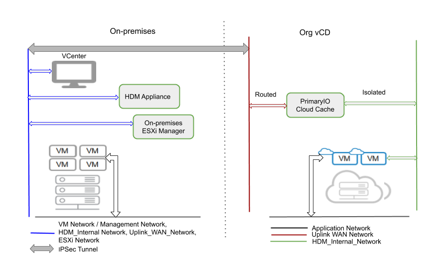

This Hands-on Lab is designed to quickly enable you to setup 
a sandbox environment with no network segregation and DHCP. This 
will allow you deploy the product and exercise the functionality. 
The intention is to effectively understand the value HDM
has to offer for migration.

# Lab Setup

Setup the Lab without any network segregation with DHCP and connectivity to the
target VCD cloud as shown in the _figure 1_.


_Figure 1: Lab Connectivity_


1. Setup the source environment.
   1. Setup a <a name="single">Single Network</a> with DHCP service with IPs in 192.168.x.x
   1. Provision 2 servers with at least 96 GB RAM.
   1. Deploy and configure these 2 ESXi (6.5U2+ or 6.7) with Management on the Single Network
   1. Deploy vCenter Server (6.5 or 6.7) and configure it over the Single Network.
   1. Add the ESXi to the vCenter.
   1. Provision <a name="shared-ds">Shared datastore</a> with at least 1 TB storage.
   1. Configure the two ESXi into a cluster 
   1. Add the shared storage to the 2 ESXi within the cluster.

Your on-premises configuration is over now we will configure the target cloud. 

1. Setup Networking on target VCD
   1. In the next step you will create the required networks on the cloud target and setup IPSec tunnel. If your VCD is within the Lab you can skip the IPSec tunnel configuration in the step below.
   1. Please follow the step in [ORG VDC System and Network Configuration](http://docs.primaryio.com/hdm%20documentation/vcd/network%20planning/cloud%20network%20config)
   1. After the ORG VDC setup is complete you will have Networks configured 
   on the target cloud and a IPSec tunnel to connect to it.
   1. Setup a DHCP service on both the UPLINK_WAN_NETWORK and HDM_INTERNAL_NETWORK which was setup in step 1 with IPs in 192.168.x.x

Test connectivity.

1. Test that the VCD tenant portal can be accessed from source environment.
1. Deploy a TestVM on the source with Network connected to the Single Network.
1. Make a remote desktop connection to TestVM.
1. Over the RDP try and connect to the tenant portal.
1. If you are able to connect successfully you setup is operational. 

# Download PrimaryIO HDM

To obtain your license and download link for HDM, visit [https://www.primaryio.com/ibm/](https://www.primaryio.com/ibm/)

You will receive an email with the following:

*   A link to download the PrimaryIO HDM software
*   A link to training videos.
*   A license key for the software

Before proceeding with the installation, watch the training videos ([https://www.primaryio.com/training/](https://www.primaryio.com/training/)) and use this guide. 


# Step 4: Deploy the HDM Appliance


*   Make sure you have at least 10GB free space to download the appliance
*   Unzip the file _HDM_2.1.zip_ from the download link

Deploy the appliance using the vCenter UI 


<table>
  <tr>
   <td>


   </td>
   <td>
<ul>

<li>Perform the step as directed by the UI.

<li>Select <em>Single Network</em> created <a href="#single">during lab setup</a>.
<li> Select IP Allocation as DHCP.
</ul>
   </td>
  </tr>
</table>


 


<table>
  <tr>
   <td>


   </td>
   <td>
<ul>

<li>Skip the Customize template.
<li>Complete OVF deployment.
<li>Power on the appliance.
</li>
</ul>
   </td>
  </tr>
</table>


# Step 5: Validate the Network Configuration


<table>
  <tr>
   <td>

   </td>
   <td>
<ul>

<li>All ESXi servers in vCenter should be connected
</li>
</ul>
   </td>
  </tr>
</table>


<table>
  <tr>
   <td>

   </td>
   <td>
<ul>

<li>The ESXi server must be able to communicate with vCenter. Test this using the ping command from the ESXi server to the vCenter FQDN (or IP)

<li>Check to ensure the appliance is powered on
</li>
</ul>
   </td>
  </tr>
</table>


# Step 6: On-premises Deployment


## Add on-premise vCenter


*   Locate the IP address of the appliance
*   Enter _https://&lt;appliance-ip>_ in the appliance web interface
*   Login to the appliance web UI using default password: 2Hdm$aK!N@h!
*   After login, select 


<table>
  <tr>
   <td>


   </td>
   <td>
<ul>

<li>Select <em>Add vCenter</em>
</li>
</ul>
   </td>
  </tr>
</table>


<table>
  <tr>
   <td>


   </td>
   <td>
<ul>

<li>Enter the vCenter credentials

<li>Select <em>Add</em>
</li>
</ul>
   </td>
  </tr>
</table>


<table>
  <tr>
   <td>


   </td>
   <td>Register the vCenter plugin by selecting <em>Register</em>
   </td>
  </tr>
</table>


vCenter configuration is now complete. Log into the newly-configured vCenter.


```
Note:
For the plugin to be visible within vCenter, you will need to logout/login to the vCenter at least twice.
```


## Configure the License

Navigate to the _Licensing_ page on the HDM vCenter Plugin


<table>
  <tr>
   <td>


   </td>
   <td>
<ul>

<li>HDM plugin can be accessed directly via the Menu

<li>It can take approximately five minutes to load HDM the first time it is accessed

<li>On the <em>Licensing</em> tab, select <em>Add License</em>

<li>Add the license key received by mail
</li>
</ul>
   </td>
  </tr>
</table>


## Configure the On-premises vCenter


<table>
  <tr>
   <td>


   </td>
   <td>
<ul>

<li>Select <em>Administration</em>, then <em>Configuration</em>

<li>Choose the cluster where you want to install vCenter

<li>Select <em>Install</em>
</li>
</ul>
   </td>
  </tr>
</table>


<table>
  <tr>
   <td>


   </td>
   <td>
<ul>

<li>For vCD, choose: 
<ul>
 
<li>Resource: Ultra-Lite
 
<li>Deployment: Cluster or Standalone
</li> 
</ul>

<li>Only choose these options (this guide is only tailored to this configuration)
</li>
</ul>
   </td>
  </tr>
</table>


<table>
  <tr>
   <td>


   </td>
   <td>
<ul>

<li>Complete all steps to begin the deployment
<li>Choose shared storage <a href="#shared-ds">created during lab setup</a> 
<li>Choose DHCP in all network configurations.
<li>This step will take a few minutes to complete. Progress will be shown on the vCenter task bar.
</li>
</ul>
   </td>
  </tr>
</table>


# Step 7: Cloud Deployment


## Configure Cloud vCenter


<table>
  <tr>
   <td>


   </td>
   <td>
<ul>

<li>Select <em>Clouds</em>, then <em>Add Cloud</em>

<li>The cloud configuration wizard will pop-up automatically
</li>
</ul>
   </td>
  </tr>
</table>


<table>
  <tr>
   <td>


   </td>
   <td>
<ul>

<li>Choose vCloud Director

<li>Enter vCD credentials

<li>Select <em>Add</em>

<li>Please note, it will take approximately 5 minutes to configure vCD and move to the next screen
</li>
</ul>
   </td>
  </tr>
</table>


<table>
  <tr>
   <td>


   </td>
   <td>
<ul>

<li>Choose vApp to deploy HDM cloud components

<li>Choose the highest performance for rapid transfer
</li>
</ul>
   </td>
  </tr>
</table>


<table>
  <tr>
   <td>


   </td>
   <td>
<ul>

<li>For Parts 1 and 2, choose <em>DHCP</em>
</li>
</ul>
   </td>
  </tr>
</table>


### WAN Routing Configuration


<table>
  <tr>
   <td>


   </td>
   <td>
<ul>

<li> Set the WAN subnet for both prem & cloud.
<li> Set the gateway for WAN both sides.
<li> DON'T Skip this step.
</li>
</ul>
   </td>
  </tr>
</table>


<table>
  <tr>
   <td>


   </td>
   <td>
<ul>

<li>Map on-premises single network to UPLINK_WAN_NETWORK.
<li>Depending on the chosen configuration and uplink speed, this step may require up to an hour to complete
</li>
</ul>
   </td>
  </tr>
</table>


<table>
  <tr>
   <td>


   </td>
   <td>
<ul>

<li>To ensure the deployment has been successful, select <em>HDM</em> from the Menu, followed by the <em>Administration</em>, <em>HDM Health</em>, and <em>Component Health</em> tabs

<li>Check the status. If it is green, it is ready to begin migration 
</li>
</ul>
   </td>
  </tr>
</table>


# Step 8: Perform a Cold Migration

During cold migration, the VM being migrated is powered off. After the migration has been completed on the cloud, the VM can be powered back on.


```
NOTES:
Migrations will be successful for VMs where network and disk interfaces are accessible to HDM via VMware APIs.
If network or disk interfaces are added dynamically, the virtual machine will need to be powered down to allow 
the newly added network and disk interface information to become available to HDM via VMware APIs.
Before migration is triggered, ensure that the health of the HDM components is green. 
```


<table>
  <tr>
   <td>


   </td>
   <td>
<ul>

<li>Right-click on the VM 

<li>Select <em>Migrate</em>

<li>The migration wizard will pop-up automatically
</li>
</ul>
   </td>
  </tr>
</table>


<table>
  <tr>
   <td>


   </td>
   <td>
<ul>

<li>Complete all steps 
</li>
</ul>
   </td>
  </tr>
</table>


<table>
  <tr>
   <td>


   </td>
   <td>
<ul>

<li>The migration status will be displayed in the wizard, as well as in vCenter tasks

<li>Following successful migration, the VM will be ready for use in the cloud

<li>To migrate multiple VMs and the HDM dashboard, please refer to the HDM 2.1.3 Admin Guide
</li>
</ul>
   </td>
  </tr>
</table>


  
# <a name="appendix-a">Appendix A - System Requirements</a>


<table>
  <tr>
   <td><strong>Requirement</strong>
   </td>
   <td><strong>Available (Yes / No)</strong>
   </td>
  </tr>
  <tr>
   <td>On-premises Requirements
   </td>
   <td>
   </td>
  </tr>
  <tr>
   <td>VMWare Environment
   </td>
   <td>
   </td>
  </tr>
  <tr>
   <td>Single version of ESXi throughout the vCenter cluster
   </td>
   <td>
   </td>
  </tr>
  <tr>
   <td>ESXi in connected state in the vCenter
   </td>
   <td>
   </td>
  </tr>
  <tr>
   <td>ESXi able to communicate with vCenter
   </td>
   <td>
   </td>
  </tr>
  <tr>
   <td>Clusters have ESXi 6.5U2+ and 6.7 
   </td>
   <td>
   </td>
  </tr>
  <tr>
   <td>vCenter Web Client: 6.5 or 6.7 
<p>
(Use of HTML client is recommended with Chrome v.75 +)
   </td>
   <td>
   </td>
  </tr>
  <tr>
   <td>Datastore should be VMFS, NFS, or NFSv3
   </td>
   <td>
   </td>
  </tr>
  <tr>
   <td>E1000E and VMXNet3 network adapters should be available in the on-premises vCenter
   </td>
   <td>
   </td>
  </tr>
  <tr>
   <td>DRS is enabled and HA should be enabled on the vCenter cluster 
   </td>
   <td>
   </td>
  </tr>
  <tr>
   <td>Network Environment
   </td>
   <td>
   </td>
  </tr>
  <tr>
   <td>Network speed: at least 1 Gbps (10 Gbps link is preferred)
   </td>
   <td>
   </td>
  </tr>
  <tr>
   <td>VM Network has connectivity to the cloud endpoint 
   </td>
   <td>
   </td>
  </tr>
  <tr>
   <td>VM Network has access to ESXi
   </td>
   <td>
   </td>
  </tr>
  <tr>
   <td>Hardware Requirements
   </td>
   <td>
   </td>
  </tr>
  <tr>
   <td>

<table>
  <tr>
   <td>On-premises
   </td>
   <td><strong>Total resources required for HDM</strong>
<p>
11 vCPU, 16 GB RAM, 336 GB disk
   </td>
   <td><strong>1</strong> Appliance (4 vCPU, 8 GB RAM, 144 GB disk), \
<strong>1</strong> PremMgr (3 vCPU, 4 GB RAM, 32 GB disk),
<p>
<strong>1</strong> ESXMgr (4 vCPU, 4GB RAM, 160 GB disk)
   </td>
  </tr>
  <tr>
   <td>Cloud
   </td>
   <td><strong>Total resources required for HDM equivalent to</strong>
<p>
10 vCPU, 26 GB RAM, 64 GB disk, 512 GB Cache
   </td>
   <td><strong>1 </strong>CloudMgr (4 vCPU, 6 GB RAM, 32 GB disk), \
<strong>1</strong> CloudCache (6 vCPU, 20 GB RAM, 32 GB disk, 512 GB cache)
   </td>
  </tr>
</table>


Related document: For hardware and system requirements, refer to the [VMware Hardware Compatibility List (HCL).](https://www.vmware.com/resources/compatibility/search.php)

   </td>
   <td>
   </td>
  </tr>
  <tr>
   <td>Cloud Requirements

   </td>
   <td>
   </td>
  </tr>
  <tr>
   <td>Network connectivity between on-premises and cloud environments


*   Network Link: at least 1 Gbps
*   Network Round Trip Time Latencies: less than 30 ms
   </td>
   <td>
   </td>
  </tr>
</table>


# 

