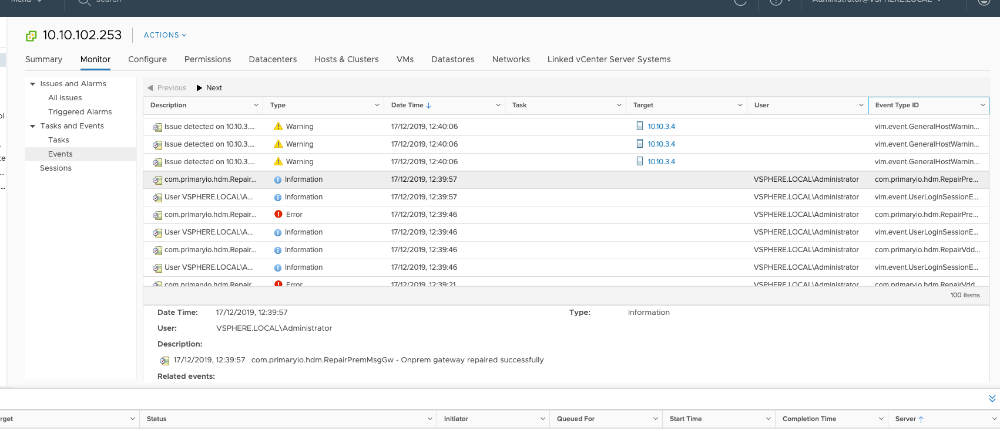

<!-- Copy and paste the converted output. -->

# **HDM 2.1 for VMware Cloud Director**

# **Admin Guide**

# About the HDM Admin Guide

This Admin Guide describes the deployment and administration of PrimaryIO Hybrid Cloud Data Management (HDM) 2.1 for migration of virtual machines to VMware Cloud Director (vCD). 

## **HDM 2.1 Software Package**

HDM 2.1 is delivered as a virtual/software solution. When HDM software is installed, it consists of a single virtual appliance. Further deployment of HDM 2.1 components then occur on-premises in VMware vCenter and in the cloud on vCD.

The HDM 2.1 package can be downloaded from [http://release.primaryio.com/vmware/HDM_2.1/](http://release.primaryio.com/vmware/HDM_2.1/2.1.2077/)

The package includes the following components:

1. HDM_2.1 zip (contains the HDM appliance as an Open Virtual Format (OVF) file)
2. vCD (contains documents for deploying and managing HDM 2.1 on vCD)
    1. HDM 2.1 Install Guide - vCD.pdf
    2. HDM 2.1 Admin Guide - vCD.pdf
    3. HDM 2.1 Troubleshooting Guide - vCD.pdf
    4. HDM 2.1 Release Notes - vCD.pdf
    5. [HDM 2.1 Quick Start Guide - vCD.pdf](http://release.primaryio.com/vmware/HDM_2.1/2.1.2077/VCD/HDM%202.1%20Quick%20Start%20Guide%20-%20VCD.pdf)
    6. HDM 2.1 Deployment Checklist - vCD.pdf

# Introduction

## Compute and Data De-Coupling

HDM decouples compute (Virtual Machines - VM) and storage (Virtual Disks - VMDK) functions to quickly and efficiently move workloads to public clouds by identifying the frequently used data (hot dataset) and only moving the minimum amount of that data to the cloud. This enables workloads to be accessed in the shortest possible timeframe.

## Components

HDM consists of the following components that are dispersed between cloud and on-premises data centers (figure 1). These components are microservices packaged as VMs that work together to provide the data and control path necessary for its use cases. They also provide a flexible deployment model and failure resilience.

HDM 2.1 consists of microservices that have been packaged as VMs that work together to provide the data and control path to support the aforementioned use cases and to provide a flexible deployment model and failure resilience. HDM comprises the following components, dispersed between cloud and on-premises data centers (figure 1): 

1. **PrimaryIO Plug-in: **Installed and registered on VMware vCenter for HDM management.
2. **PrimaryIO Manager:** The main controlling appliance that controls and orchestrates the entire system.
3. **On-premises Storage Gateway:** Provides access across the WAN link to deliver traffic optimization and redundancy against failures. It also accesses and manages the on-premises VMDKs for cloud-based VMs.
4. **Cloud Storage Gateway: **Provides access across the WAN link to enable cloud-based VMs read/write access back to the on-premises environment. It is possible to have multiple gateways for redundancy.
5. **Sync Daemon:** Located in both environments to deliver compression, encryption, and de-duplication for data being transferred from on-premises to cloud environments. It also provides a mechanism to pause and resume data transfers in the event of a WAN disconnect.

_Figure 1: Location of HDM 2.1 components_

# HDM Deployment

HDM provides a flexible deployment model to support a wide range of user needs regarding use case, performance, scalability, and security. The detailed steps and options for each deployment method are covered in the **HDM 2.1 Install Guide.** This document focuses on the usage of HDM to migrate VMs to the cloud.

# HDM Migrations

HDM 2.1 is used to migrate VMs from on-premises environments to the cloud. There are two main use cases for HDM migrations:

1. **Agile Rapid Migration (ARM):** The capability to decouple compute from data, to minimize downtime during migration.
2. **Try Before Commit (TBC):** The capability to quickly test the VMs running in the cloud before fully committing to the cloud.

## Use Cases

### Agile Rapid Migration (ARM)

This use case permanently moves the VM and all of its data to the cloud. Two types of this migration are possible:

*   **Cold migration**: Application data is moved to the cloud using **bulk migration**. The VM is powered off throughout the migration and becomes available in the cloud once the data has been fully transferred. 
*   **Warm migration**: A subset of data, called the working set, is moved to the cloud and the VM is instantly available. HDM’s cloud cache is used for optimal IO performance. Any cache misses are fetched from the on-premises environment via the WAN. The remainder of the data set is either moved online through HDM, or offline in the background. Once all data has been moved to the cloud, it is reconciled with the data from the running application to minimize application downtime.

The choice of which migration type to employ depends on the amount of data in the VM and if the VM needs to be instantly available during the migration, or if prolonged downtime can be tolerated.

**NOTE: In HDM 2.1, only cold migration is supported. **

### Try Before Commit (TBC)

This use case provides a quick way to migrate VMs to the cloud while retaining the data on-premises. This helps users validate how the applications would run in the cloud, to help them decide whether or not to fully migrate them. The user can choose to migrate the applications back to the on-premises environment at any time.

**NOTE: In HDM 2.1, TBC is only supported for demo and test purposes.**

## Migrate a VM using vCenter 

This section describes the steps for executing the migration operation through vCenter. As noted above, only Cold Migration is supported in HDM 2.1. 

Pre-requisites

1. HDM must be fully deployed in the on-premises and cloud environments
2. Target vApp should have HDM_INTERNAL_NETWORK connected

### Migrate the VM

Steps

1. In the on-premises vCenter, right click on the VM/Cluster to be migrated
2. Select _HDM _followed by_ Migrate_

_Figure 2: On-Premises vCenter_

3. This will initiate the Migrate Wizard. Select the desired migration type, then _NEXT_

_Figure 3: Migration Wizard - Step 2_

4. Review the target environment for the migration to ensure adequate resources are available, then select _NEXT_

_Figure 4: Migration Wizard – Step 3_

5. Select which VMs you wish to migrate, then _NEXT_

    **NOTES: **

*   **Be sure to review the CPU and memory required in the cloud**
*   **Leave “Application Dependency” selected**

_Figure 5: Migration Wizard - Step 4_

6. Select the vApp target for the migration and the storage profile to be applied to the VM once the migration is complete, then _NEXT_

    **NOTE: The target vApp should have HDM_INTERNAL_NETWORK connected**

_Figure 6: Migration Wizard - Step 5_

7. Select the network where the virtual machine should be placed once the migration is complete, then _NEXT_

_Figure 7: Migration Wizard - Step 6_

8. Confirm your selections, then select _MIGRATE_

_Figure 8: Migration Wizard – Step 7_

The progress of the migration can be seen either on the migration status page (figure 9), or in the vCenter task page (figure 10). The migrated VM can be seen in a new resource pool HDM_MIGRATE_POOL in the on-premises vCenter and will be in a powered off state (figure 11). All migrations can be monitored in vCenter by selecting _Cluster 🡪 Monitor 🡪 HDM_, and then selecting the _Migration_ tab, followed by the _In Progress_ tab (figure 12). Virtual machines that have been migrated to the cloud can be seen in vCenter by selecting _Cluster 🡪 Monitor 🡪 HDM_, and then selecting the _Migration _tab, followed by the_ Summary_ tab.

_Figure 9: Migration Wizard – VM Migration Status Page_

_Figure 10: vCenter Task Page_

_Figure 11: vCenter Resource Pool Page_

_Figure 12: vCenter HDM Migration Progress Tab_

_Figure 13: vCenter HDM Migration Summary Tab_

# HDM Disk Controller Support

There are known limitations with virtual machine disk controller configurations when migrating to vCD. HDM does not support the following migrations:

1. Virtual machines having SATA and IDE based virtual disks
2. Virtual machines having more than 3 controllers if the first controller is not paravirtual
3. Virtual machines with more than 15 virtual disks for the first paravirtual controller
4. Virtual machines with an LSI controller as the boot disk and a paravirtual controller as data disks

# HDM System Health

HDM keeps track of the health of its constituent components using periodic messages (heartbeat). This also enables it to determine the overall health of the system. If the heartbeat from a component is missed for two minutes, the component is marked as failed. Additional probes are made to understand the nature of the failure. Once the reason for the failure is understood, the recovery process will be initiated.

## HDM in a Healthy State 

Determine system and component health by selecting _Menu_ followed by _HDM_ in the appliance control panel, then selecting the _Administration _tab, followed by the _HDM Health_ tab, and then the _Component Health_ tab.

When there are no failures, the status of all HDM components are listed as _Good_ and will appear with a green checkmark icon in the Appliance control panel (figure 14). Red or yellow icons with corresponding negative messages in the status column indicate troubles (figure 15). This information is also available on vCenter on the HDM plug-in (figure 16).

_Figure 14: Healthy Components_

_Figure 15: Component Troubles_

_Figure 16: vCenter on the HDM Plug-in_

## HDM in a Degraded State

When system health is degraded, it can be viewed using any of the following tools:

1. The vCenter dashboard
2. The appliance control panel
3. The vCenter event log
4. The state in the SQS heartbeat

### vCenter Dashboard

Access the vCenter dashboard by selecting HDM, followed by the _Dashboard_ tab. It will contain a notification such as, “Services not ready or down ...” (figure 17)

_Figure 17: vCenter Dashboard_

### Appliance Control Panel

The appliance control panel will update the status of failed components as “Poor” and HDM overall state will be set to “Not Ready”. The component color will also change from blue to red (figure 18). To get details about the error, hover your cursor over the failed component (figure 19).

     

_Figure 18: Appliance Control Panel: Determining Failed Components_

_Figure 19: Appliance Control Panel: Details on Failed Components_

### vCenter Event Log

Access the vCenter event log by selecting _HDM_ from the menu, followed by the _Administration, HDM Health,_ and _Event Logs_ tabs (figure 20). All failure events that impact the operation of HDM will be recorded here (NOTE: repair and recovery events will also be shown). In the example in figure 20, the most recent failure is unrecoverable and therefore requires an HDM reset. You can obtain additional details on any failure messages by selecting _vCenter_ from the menu, followed by the _Monitor_ and _Events_ tabs (figure 21).

_Figure 20: vCenter Event Log_

_Figure 21: Event Log Details_

To isolate the events generated by the HDM, a filter can be applied to the “Event Type ID” on the extreme right hand column. Figure 22 illustrates this by applying the filter, _“com.hdm”_ which limits the view to the events generated by HDM.

_Figure 22: Applying Filters_

# Failure Handling in HDM 

HDM handles failures in the following manner:

*   In the case of specific HDM component failures, cold VM migration will be resumed automatically, following the repair.
*   In pathological cases where migration cannot be automatically resumed, VM availability will be maintained, so all data can be recovered following the failure. 
*   HDM system state will be recovered so that new migrations can be served, even if prior migrations have been cancelled and the migrated VMs migrated back. 

## Ensuring VM Availability 

As a component of failure recovery, HDM will resume the transfer of any VM in the process of a cold migration. In the case of a TBC migration, HDM may identify that some VMs that were already migrated, or some ongoing migrations, can no longer continue to run in the cloud. This is typically due to a failure in the component that was used by the VM to connect to the on-premises environment. To ensure application availability, these VMs are migrated back to the on-premises environment. 

## HDM Failure Recovery

### Nature of Failures

HDM mainly deals with the following types of errors:

*   HDM Component Failures
    *   Appliance Restarts
    *   HDM component VM restarts
    *   HDM individual component failure due to software issues 
*   Network failures
    *   Transient network disconnects
    *   Permanent network disconnects
*   System failures
    *   Storage failures
    *   Memory errors

### Single Component Failure

The impact of the failure can result in a single HDM component failing. HDM is designed to automatically recover from these failures. The following scenarios are possible:

*   Failure when there is no activity
*   Failure during migrations
*   Failure when there are migrated VMs
*   Recovery resource pools

### Failure When There is No Activity

Even when the system is idle after a successful deployment, a component failure may cause it to go from “Healthy” to “Degraded”. 

The HDM system health in the degraded state can be viewed in vCenter and Appliance (See System Health section for details). The vCenter events log would also list the component failure as a new event.

HDM would attempt to recover from the failure and bring the system back to a “Healthy” state. The recovery process would include three important stages:

*   Failure detection and move to a degraded state
*   HDM system repair
*   Return to a healthy state

After recovery, a message is logged in the vCenter events log:

_Figure 23: Post-Recovery Message in vCenter Events Log_

### Failure During Migrations

If a failure occurs during the migration operation, HDM will move to a degraded state. HDM will repair itself and return to a healthy state. The ongoing migration operation will be paused once the failure is detected and resumed once the repair operation is completed and the system has returned to a healthy state.

For redundant components like the HDM message gateway, recovery can only be considered complete after the required level of redundancy has been restored. Any migration operation attempted before the recovery is complete will result in a failure.

#### Failure When There are Migrated VMs

(Applicable for TBC)

Some VMs that have already migrated to the cloud may be affected by a component failure, causing them to be migrated back to the on-premises environment. The VMs would contain the data until after the last RTO/RPO flush.

**NOTES: **

1. As part of the failure recovery, if the VMs that were migrated back can be successfully booted, they will be in the HDM_RECOVERY_SUCCESS pool. Otherwise, they will be placed in the HDM_RECOVERY_FAILED pool. 
2. There are cases where HDM is unable to automatically repair its failed component. This could be due to a software issue, or if the error condition is permanent (e.g., a permanent network or storage disconnect). In such cases, users can issue an HDM reset to start over again. See the Troubleshooting section for more details.

#### Recovery Resource Pools

(Applicable for TBC)

VMs that are migrated back as part of a failure recovery are kept in one of two types of recovery resource pools:

##### **HDM_RECOVERY_SUCCESS **

This resource pool hosts the VMs that have been migrated back as part of failure handling and are likely to be successfully booted using the on-premises vCenter. However, they may have some data loss equivalent to the last RTO/RPO flush cycle (default 20 minutes).

##### **HDM_RECOVERY_FAILED **

This resource pool hosts the VMs that have been migrated back as part of failure handling but are unlikely to have consistent data. These VMs will be required to restore their data from the migration time snapshot.

**NOTE: **Restoring data from the migrate time snapshot means that all data from the time the VM was in the cloud environment will be lost.

##### **Recovering VMs From the HDM Recovery Pools**

Follow these steps to recover VMs from the recovery source pools:

1. Power on the VM and verify the sanity of the data
2. If the power-on and data sanity checks pass:
    1. Delete the HDM migration time snapshot
    2. Move the VM to its pre-migration resource pool
3. If the power-on or the data sanity fail:
    3. Restore the data from the migrate time snapshot
    4. Delete the HDM migrate time snapshot
    5. Move the VM to its pre-migration resource pool
    6. Power on the VM 

**NOTE: **Failure to move the VMs to their original resource pool will cause their subsequent migration and migration back from the HDM to be limited to the recovery pool. 

### Multiple Component Failure

If second component fails while the system is still recovering from the failure of a single component, HDM will detect the failure and notify the user through vCenter events. This is also applicable if simultaneous multiple HDM component hosts restart. HDM components may not fully recover and ongoing migrations will not resume. Multiple component failures may require an HDM reset to restore the system.

### HDM Appliance Restart

Restarting the Appliance does not impact migrated VMs, nor does it impact future migration operations.

Operations that are in progress during the appliance restart will be affected in the following way:

1. The ongoing bulk transfer of an ARM cold migration will pause and resume once the appliance has successfully restarted
2. VM migration to the cloud will resume after restart and should successfully complete without any problems
3. The vCenter plug-in will display a message that it cannot connect with the appliance until after restart

### HDM Component VM Restart

The HDM deployment consists of a set of microservices that are packaged as Docker containers inside the VM that are deployed on-premises, as well as in the cloud. Depending on the deployment type, one or both of the following VMs may be present:

*   HDM_Cloud_Cache
*   HDM_OnPrem_ESXi_Manager

 

When either of these are rebooted, the following repair actions are triggered:

1. All components within that VM are repaired
2. A vCenter event is logged specifying a “Docker reboot” has occurred, specifying the particular VM which has restarted
3. Ongoing cold migrations are paused, and then resumed once the HDM component VM has been restarted
4. All future operations involving the repaired components should work correctly
5. TBC migrations will roll back to their on-premises locations and be restored to their previous RTO/RPO checkpoints

### WAN Disconnect

The WAN disconnect may result in HDM components losing network connectivity with the central heartbeat monitoring entity. 

#### Transient Network Failure

HDM can recover from short network outages (those lasting less than 2 minutes) by retrying ongoing operations.

#### Permanent Network Failure

If the network outage lasts for an extended period of time (greater than 2 minutes), the HDM recovery may not succeed and an HDM reset may be required.

### ESX Host Restart

If the on-premises ESX host is restarted, the ongoing migrations will be paused and will resume once the host is back up. 

### System Failures

System failures such as storage or memory may result in some HDM component failures, or their impact could be limited to a few operations or IOs. In these cases, the impacted process will be retried.

#### Boot Failure During Migrate (TBC Use Case)

Guest VM boot may fail due to reasons such as VMware tools not starting early enough to detect a successful boot. HDM will retry (in this case reboot) the operation a few times. 

**NOTE**: Multiple retries can delay the boot. In these cases, the user may have to wait up to 30 minutes for the migration operation to complete.

### Unresolved Issues

Refer to the HDM 2.1 Troubleshooting Guide if the failure issues are not resolved. The failure may have been caused by a known product issue. 

If PrimaryIO technical support is required, refer to the Install Guide for the details. 
