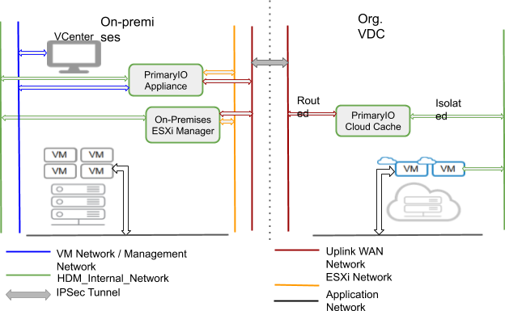

# **HDM 2.1 - Org VDC System and Network Configuration**

By now you understand the use cases for HDM, the resources 
required and the tradeoffs associated with each of the
configurations in which HDM may be deployed.

In this section we will show you how to configure the Organization VDC side network and system configuration required for HDM deployment.


# Network Configuration


## <a name="create-routed-network"> Step 1/3  : Create Routed Network UPLINK_WAN_NETWORK

This network will be connected to the edge gateway. Across WAN communication between on-premise and on-cloud for HDM appliance will be routed through this network. IPsec tunnel in [step 3](#step-3) will be configured to this network to complete the network configuration.


1. Create a new network and select Routed Network Type


2. Provide the name  “UPLINK_WAN_NETWORK” and Gateway CIDR for the network. Note the CIDR as this would be required when creating VPN connection between premise and edge gateway on cloud.


3. Select the edge gateway 


4. Specify static-ip pool of at least 20 IP addresses


5. Add DNS records if required


6. Review and click on finish to create the routed network


## 


## Step 2/3  : Create Isolated Network HDM_INTERNAL_NETWORK

This network will be created for HDM appliance communication and for migrating virtual machines across vApps for the same Org. VDC.


1. Create a new network and select Isolated Network Type


2. Provide the name “HDM_INTERNAL_NETWORK” and Gateway CIDR for the network. Make sure enough IPs are available in the subnet as this would be used for migrating virtual machines. The network would be assigned during migration and then removed post-migration.





3. Specify static-ip pool or at least 30 IPs.


4. Review and click on finish to create the isolated network


## 


## <a name="step-3"> Step 3/3  : Configure VPN tunnel with Org. Edge Gateway </a>

Create an IPSec tunnel between the organization edge gateway and on-premise datacenter. To complete the VPN setting the following information would be required:


*   Local ID - Edge gateway tenant external network IP 
*   Local Endpoint - Edge gateway tenant external network IP
*   Local Subnets - Routed network subnet where HDM appliances will be deployed ([Create Routed Network](#create-routed-network))
*   Peer ID - Public IP for the on-premise WAN network
*   Peer Endpoint - Public IP for the on-premise WAN network
*   Peer Subnets - Subnet of the on-premise WAN network where HDM appliances will be deployed.


### Edge gateway VPN config 


### Recommended firewall rules

Add recommended firewall rule by specifying source and destination subnet


### Service/Port level requirement for HDM(Advanced firewall rules)


1. Premise wan network - Cloud wan network ports(Inbound/Outbound):** **22, 2379, 32820, 2376, 6000-6050, 7000-7050, 8000-8050.


You can test the IPsec connectivity using ping command from on prem to cloud side routed network gateway. If you have configured advanced firewall rules please make sure ICMP traffic is allowed.

Ping test from premise to cloud side gateway


Ping test from Cloud to Premise IP, you need to create test machine on routed network of cloud side.


# System Configuration


## Configure vApp for HDM Deployment

The components of HDM need to be deployed on a vApp. If you don’t already have a vApp for this purpose please create it.

Attach Org VDC network UPLINK_WAN_NETWORK and HDM_INTERNAL_NETWORK which were created in step 1 and 2 earlier in this document to vApp where HDM will be deployed. 

**NOTE: HDM_INTERNAL_NETWORK should be added to all vApps where VMs will be migrated.**


# Network Planning for Single Network

This single network planning is intended to help you rapidly deploy PrimaryIO HDM to a test environment. The steps are intended for a single on-premises network environment, with cloud access via a WAN link and no separation of the management and VM network. All IP assignments in this guide are static/static-pool and connectivity between the on-premises and cloud environments is via IPSec. 

HDM provides a flexible deployment model to cater to a wide range of user needs, including different use cases, performance requirements, scalability, and levels of security. The HDM 2.1 Install Guide contains full details of every deployment mode. For simplicity, this document describes an HDM deployment using the **_Standalone, Ultra-Lite_** option. This option supports all the key features of HDM and can also be used for cold migration and validation purposes. 


Network configuration information is required at key points throughout the deployment process. So, develop a network connectivity plan prior to deploying HDM. This section will help guide you through that process. The information captured in this section will be employed later in the installation process. If an IPSec tunnel and cloud configuration have not yet been established, these must be done before moving any further. Follow the steps outlined in [Appendix C](#appendix-c) of this document. Please be aware that this process will add 30 minutes to the estimated time to complete this section. 

Once connectivity and cloud configuration are complete, be sure to record all applicable details in [Appendix B](#appendix-b) of this document for easy reference later in the deployment process. 

The following is required to complete the network plan: 


1. IPSec tunnel, firewall, and cloud network configuration information (See [Appendix C](#appendix-c))
2. Network requirements during OVF deployment
3. Network requirements during on-premises deployment
4. Network requirements during cloud deployment

    ```
Choose or Create an appropriate network:

A simple network configuration where all connectivity to the cloud is available through one network (e.g., hdm_network). Here hdm_network should have access to the following:
On-premises vCenter 
Cloud vCenter via WAN link
On-premises ESXi
Cloud ESXi
HDM Appliance

The required connectivity is highlighted in figure 1. For all steps in the deployment that require a VMware network as input, provide the identified or created hdm_network. It will also be necessary to create two networks in the cloud, hdm_routed_network and hdm_internal.

Failure to create, choose, or configure the networks correctly will cause the installation to fail.

Figure 1: Network Configuration of the Test Environment


The remainder of this document will assume you have created a network topology like the one shown in Figure 1, and will refer to the networks by those names. In this configuration, all access has been made possible using single VM network, _hdm_network_.

You will need to provision 


*   20 static IPs on Premise network
*   At least 50 static-pool IPs on Cloud network

These will be required throughout the installation process.


```
NOTE: 
Despite the fact that you will be mapping to a single network, separate IP ranges will need to be provided for each network type.
The subnet range 172.17.0.0/16 is not available for the deployment; it is used internally by HDM microservices.
Please add the vCenter FQDN for the on-premises and cloud vCenters on the on-premises and cloud DNS servers.
```


# Network Configuration forms

Before continuing with the rest of this Quick Start Guide, be sure to print and complete these forms. This will help you identify the correct networks to configure and identify all networking details.


## Network requirements during OVF deployment


*   Provision four IPs on _hdm_network_
*   Use this during OVF deployment

<table>
  <tr>
   <td>
<strong>Network</strong>
   </td>
   <td>IP 
   </td>
   <td>Netmask
   </td>
   <td>Gateway
   </td>
  </tr>
  <tr>
   <td>VM Network (Management Network)
   </td>
   <td><em>Single IP</em>
   </td>
   <td>
   </td>
   <td>
   </td>
  </tr>
  <tr>
   <td>HDM_Internal_Network
   </td>
   <td><em>Single IP</em>
   </td>
   <td>
   </td>
   <td>
   </td>
  </tr>
  <tr>
   <td>Uplink_WAN_Network
   </td>
   <td><em>Single IP</em>
   </td>
   <td>
   </td>
   <td>
   </td>
  </tr>
  <tr>
   <td>ESXi_Network
   </td>
   <td><em>Single IP</em>
   </td>
   <td>
   </td>
   <td>
   </td>
  </tr>
</table>


Common settings for the OVF deployment


<table>
  <tr>
   <td>Default gateway network
   </td>
   <td><em>This should be the single configured network on-premises which in this document is “hdm_network”</em>
   </td>
  </tr>
  <tr>
   <td>NTP Server
   </td>
   <td>
   </td>
  </tr>
  <tr>
   <td>Network DNS
   </td>
   <td>
   </td>
  </tr>
  <tr>
   <td>Default gateway
   </td>
   <td><em>Provide default gateway for the “hdm_network”</em>
   </td>
  </tr>
  <tr>
   <td>Network DNS Search Path
   </td>
   <td>
   </td>
  </tr>
</table>


## Network requirements during on-premises deployment

Common settings for the gateway, subnet, DNS etc., which will be common across the on-premises networks.


<table>
  <tr>
   <td><strong>Subnet mask</strong>
   </td>
   <td><em>255.255.0.0</em>
   </td>
   <td>
   </td>
  </tr>
  <tr>
   <td><strong>Gateway</strong>
   </td>
   <td><em>192.168.10.1</em>
   </td>
   <td>
   </td>
  </tr>
  <tr>
   <td><strong>Domain</strong>
   </td>
   <td><em>domain.lan</em>
   </td>
   <td>
   </td>
  </tr>
  <tr>
   <td><strong>DNS</strong>
   </td>
   <td><em>192.168.5.20, 192.168.5.21</em> 
   </td>
   <td>
   </td>
  </tr>
  <tr>
   <td><strong>NTP</strong>
   </td>
   <td><em>192.168.5.22</em>
   </td>
   <td>
   </td>
  </tr>
</table>


**HDM_Internal_Network**

Provision six IPs on _hdm_network_. complete the table below for reference throughout deployment.


<table>
  <tr>
   <td>
   </td>
   <td><strong>Example</strong>
   </td>
   <td><strong>Fill value here</strong>
   </td>
  </tr>
  <tr>
   <td><strong>IP range</strong>
   </td>
   <td><em>192.168.10.100-192.168.10.120, 192.168.10.130 </em>
   </td>
   <td><strong>(2 IPs required from “hdm_network” )</strong>
   </td>
  </tr>
</table>


** \
Uplink_WAN_Network**


<table>
  <tr>
   <td>
   </td>
   <td><strong>Example</strong>
   </td>
   <td><strong>Fill value here</strong>
   </td>
  </tr>
  <tr>
   <td><strong>IP range</strong>
   </td>
   <td><em>192.168.10.100-192.168.10.120, 192.168.10.130 </em>
   </td>
   <td><strong>(2 IPs required from “hdm_network”)</strong>
   </td>
  </tr>
</table>


**ESXi_Network**


<table>
  <tr>
   <td>
   </td>
   <td><strong>Example</strong>
   </td>
   <td><strong>Fill value here</strong>
   </td>
  </tr>
  <tr>
   <td><strong>IP range</strong>
   </td>
   <td><em>192.168.10.100-192.168.10.120, 192.168.10.130 </em>
   </td>
   <td><strong>(2 IPs required from “hdm_network”)</strong>
   </td>
  </tr>
</table>


## Network requirements during cloud deployment

The following cloud credentials are required to deploy to the cloud.


<table>
  <tr>
   <td><strong>vCloud Director FQDN</strong>
   </td>
   <td><em>xyzpqr25.vmware-solutions.cloud.ibm.com</em>
   </td>
  </tr>
  <tr>
   <td><strong>Organization name</strong>
   </td>
   <td>
   </td>
  </tr>
  <tr>
   <td><strong>Username</strong>
   </td>
   <td>
   </td>
  </tr>
  <tr>
   <td><strong>Password</strong>
   </td>
   <td>
   </td>
  </tr>
</table>


Similar to the previous two deployment stages, provision IPs and identify the correct networks to satisfy the chosen connectivity requirements. The networks to be configured are _HDM Internal network_ and _WAN network configuration** **_from the cloud _hdm_wan_network**. **_Only the IP Range is different between the two networks; all other parameters remain the same.

**HDM Internal network** 


<table>
  <tr>
   <td>
   </td>
   <td><strong>Example</strong>
   </td>
   <td><strong>Fill value here</strong>
   </td>
  </tr>
  <tr>
   <td><strong>IP range</strong>
   </td>
   <td><em>192.168.10.100-192.168.10.120, 192.168.10.130 </em>
   </td>
   <td><strong>(20 IPs from HDM “hdm_internal)</strong>
   </td>
  </tr>
  <tr>
   <td><strong>Subnet mask</strong>
   </td>
   <td><em>255.255.0.0</em>
   </td>
   <td>
   </td>
  </tr>
  <tr>
   <td><strong>Gateway</strong>
   </td>
   <td><em>192.168.10.1</em>
   </td>
   <td>
   </td>
  </tr>
  <tr>
   <td><strong>Domain</strong>
   </td>
   <td><em>domain.lan</em>
   </td>
   <td>
   </td>
  </tr>
  <tr>
   <td><strong>DNS</strong>
   </td>
   <td><em>192.168.5.20, 192.168.5.21</em> 
   </td>
   <td>
   </td>
  </tr>
  <tr>
   <td><strong>NTP</strong>
   </td>
   <td><em>192.168.5.22</em>
   </td>
   <td>
   </td>
  </tr>
</table>


**WAN network configuration**


<table>
  <tr>
   <td>
   </td>
   <td><strong>Example</strong>
   </td>
   <td><strong>Fill value here</strong>
   </td>
  </tr>
  <tr>
   <td><strong>IP range</strong>
   </td>
   <td><em>192.168.10.100-192.168.10.120, 192.168.10.130 </em>
   </td>
   <td><strong>(30 IPs from “hdm_wan_network”)</strong>
   </td>
  </tr>
  <tr>
   <td><strong>Subnet mask</strong>
   </td>
   <td><em>255.255.0.0</em>
   </td>
   <td>
   </td>
  </tr>
  <tr>
   <td><strong>Gateway</strong>
   </td>
   <td><em>192.168.10.1</em>
   </td>
   <td>
   </td>
  </tr>
  <tr>
   <td><strong>Domain</strong>
   </td>
   <td><em>domain.lan</em>
   </td>
   <td>
   </td>
  </tr>
  <tr>
   <td><strong>DNS</strong>
   </td>
   <td><em>192.168.5.20, 192.168.5.21</em> 
   </td>
   <td>
   </td>
  </tr>
  <tr>
   <td><strong>NTP</strong>
   </td>
   <td><em>192.168.5.22</em>
   </td>
   <td>
   </td>
  </tr>
</table>

