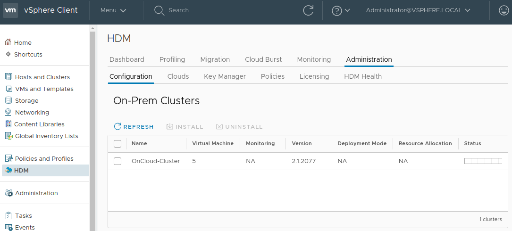

<!-- Copy and paste the converted output. -->

# **HDM 2.1 for VMware Cloud Director**

# **Install Guide**

# About the HDM Install Guide

The HDM install guide describes how to deploy, configure, and undeploy PrimaryIO Hybrid Data Management (HDM) 2.1 for enabling migrations of virtual machines to VMware Cloud Director (vCD).

## HDM Deployment Steps

HDM deployment involves the following six steps, each of which is discussed in detail in the sections below:

1. Deploy the HDM appliance on-premises
2. Add the on-premises vCenter to the HDM appliance
3. Register the HDM plug-in to the on-premises vCenter
4. Add the HDM license
5. Deploy HDM on-premises
6. Deploy HDM in the cloud

### Step 1: Deploy the HDM Appliance On-premises

#### Placement of HDM Appliance

1. The appliance must be deployed on the same on-premises vCenter it will manage.
2. The appliance should reside in a different cluster than the one it will manage for migrations.

#### Deployment and Configuration

The HDM appliance must be installed from the OVF in the HDM package. Be sure to check that the placement and sizing of the deployment conforms to the requirements mentioned above. To deploy the appliance, use the “Deploy OVF Template**” **option in vCenter (figure 6).

_Figure 6: Launching the “Deploy OVF” Template in vCenter_

#### Network Configuration for the Appliance

Appliance network configuration requires that the available networks be categorized into four types, described in the Network Requirements  and HDM Resource Requirements sections, above. While it is recommended to keep these networks separate, it is possible for each of them to point to a single network. In addition, the decision must be made at this point to deploy using a static IP or DHCP protocol (figure 7).

_Figure 7: Configuring the Network_

#### IP Address Details

(_If DHCP is chosen, this section can be skipped)_

For each network type, choose the IP allocation protocol: static or DHCP. The following details are required if static IP is chosen (figure 8):

*   IP range: list of IP addresses that are free to be allocated to various HDM components
*   Subnet mask: subnet of the IP range
*   Gateway: gateway IP of the network
*   Domain: domain name of the network
*   DNS: domain name translation for the IP address
*   NTP: server that will be used for time synchronization

**NOTES**:

1. If static IP is chosen, failure to specify an NTP server may cause further HDM operations to fail.
2. If static IP is chosen, the gateway IP and the specified IP range must be in the same subnet.

_Figure 8: Configuring the System for Static IP Protocol_

#### Power on the Appliance

Complete the rest of the wizard and wait for the deployment to complete. Then, use vCenter to power on the appliance.

#### Enable VMware HA on the Appliance

(_This step should only be performed for HDM cluster mode deployments_)

VMware HA should be enabled on the cluster where the HDM appliance has been deployed. To complete this procedure, do the following:

1. In the on-premises vCenter, select the cluster where the HDM appliance is deployed
2. Select the “Configure” tab from the right-hand pane and navigate to _Services_ 🡪 _vSphere Availability_
3. If the vSphere HA is turned off, select _EDIT_ and _Enable vSphere HA_

### Step 2: Add the On-premises vCenter to the HDM Appliance

**NOTE**: The On-premises vCenter should be added to the same location as the HDM appliance. 

Pre-requisites

1. Ensure that the HDM appliance is powered on and valid vCenter administrator credentials are available.

Steps

1. Log into the HDM Appliance by accessing _https://&lt;appliance ip>_ in a supported web browser and enter the administrator credentials. The default administrator username and password are _‘administrator’_ and _‘2Hdm$aK!N@h!’,_ respectively. The default password should be changed immediately after the first login.
2. Select _vCenters_ from the top pane.
3. Select _Add vCenter_ at the top right (figure 9).

_Figure 9: Adding vCenter to the HDM Appliance_

4. Specify the on-premises vCenter IP, or the FQDN that was set for the vCenter during its installation. Enter the administrator credentials, and then select _Add vCenter_. The HDM appliance should now list the on-premises vCenter (figure 10).

_Figure 10: Viewing the On-Premises vCenter on the HDM Appliance_

## Step 3: Register the HDM Plug-in to On-premises vCenter

1. Select _Register** **_to register the HDM plug-in to on-premises vCenter.
2. Logout, then login twice from the vCenter for the plug-in installation to complete. Successful installation should add an HDM icon to the vCenter home page (figure 11). Sometimes, multiple login/logout cycles may be required for this step to complete.

_Figure 11: HDM Icon on the vCenter Home Page_

**NOTE:** The PrimaryIO vCenter plug-in will be automatically registered on all vCenter instances that are configured in enhanced linked mode.

## Step 4: Add the HDM License

Following deployment, a license key is required to activate HDM. A trial license will be shared with the product which can be used to activate HDM.

**NOTE**: Initial product settings need to be initialized, so it may take a few minutes to load the HDM configuration page.

Steps to add the HDM license:

1. In the on-premises vCenter, access the HDM dashboard by selecting _HDM_ from _Shortcuts_ or the vCenter menu (_It may take a few minutes for the dashboard to load)_.
2. Select the _Administration** **_tab.
3. Select _Licensing_ to add a new license, and to see existing licenses (figure 12).
4. Select _Add License** **_to open a popup where the provided **Trial License** can be pasted (figure 13).
5. Copy and paste the shared license key and select _OK_. The license will now be listed on the license page (figure 14).
6. The same interface can then be used to add the actual **Product License** obtained as part of the ordering process.

_Figure 12: Add or See HDM Licenses_

_Figure 13: "Add License" Pop-up_

 

_Figure 14: Verify the Addition of the Trial License_

## Step 5: Deploy HDM On-premises

Depending on the network bandwidth and storage, it may take between 10 and 20 minutes to deploy HDM on-premises. Any failure-retries during the deployment process will be logged into vCenter Events. To search for events generated by HDM,** _hdm_** or _com.primaryio_ keywords can be used in vCenter event search.

Pre-requisites:

At this point, it is assumed that the HDM appliance deployment and configuration steps have been successfully completed. Ensure that the HDM plug-in has been registered on vCenter and the HDM icon is visible on the vCenter home screen. A valid HDM license must be added to activate the product.

Deployment steps:

1. To access the HDM dashboard from the on-premises vCenter, select _HDM_ from _Shortcuts_ or the Menu.
2. Select the _Administration** **_tab, followed by _Configuration_ to access the on-premises cluster listing (figure 15). 

_Figure 15: vCenter On-Premises Cluster Listing_

3. Select the cluster where the HDM will be installed and select _Install_. This will open the HDM Installation Wizard (figure 16).
4. Verify that the HDM appliance IP address is correct.
5. Select the desired deployment mode based on your scale and failure tolerance requirements. See the Deployment Requirements section for details on the various deployment modes.
6. Select resource allocation based on your size and resource requirements. See Deployment Requirements section for details on the various allocation types.

_Figure 16: HDM Installation Wizard_

    **NOTE: **For migration to vCD, select _Ultra-Lite_ as the resource allocation mode.** **

7. Select the resource pool and shared datastore where the HDM components will be deployed (figure 17). Before selecting the deployment mode, take care to ensure that enough resources are available on-premises and in the cloud.

_Figure 17: Resource Pool and Shared Datastore Selection_

8. To specify the internal network configurations, start by choosing the IP allocation protocol: static or DHCP (figure 18). The following details are required if static IP is chosen:
*   IP range
*   Subnet mask
*   Gateway
*   Domain
*   DNS
*   NTP

    See the Deployment Requirements section for additional details on these requirements. These steps must be repeated for the following components:

1. HDM Internal Network (HDM_Internal_Network)
2. WAN Network (Uplink_WAN_Network)
3. ESXi Network (ESXi_Network)

    **NOTES: **

1. If all are mapping to single network, separate IP ranges must be provided for each network type.
2. The subnet range 172.17.0.0/16 is not available for the deployment; it is used internally by HDM microservices.

_Figure 18: Network Configuration Settings_

9. Confirm the selection and submit the installation request by clicking on the **FINISH** button (figure 19).

_Figure 19: HDM Installation Summary_

10. This will create a deployment task which can be monitored from vCenter Tasks. The deployment progress can also be seen in the HDM Configuration view within vCenter (figure 20).

_Figure 20: vCenter HDM Configuration View_

## Step 6: Deploy HDM in the Cloud

Depending on the WAN bandwidth and WAN latency, it may take between 10 and 20 minutes to deploy HDM components in the cloud. Any failure-retries during the deployment process will be logged into vCenter Events. To search for events generated by HDM,** _hdm_** or _com.primaryio_ keywords can be used in vCenter event search.

Pre-requisites 

1. Ensure that the HDM plug-in has been registered on vCenter and the HDM icon is visible on the home screen. 
2. Ensure that the on-premises deployment has successfully completed.
3. Ensure that the vCenter cloud is reachable from the HDM appliance. If cloud vCD is on the WAN and the WAN is not reachable through the appliance’s default route, then a static entry must be added to the HDM appliance to reach the cloud vCD. This can be accomplished by following these steps:
    1. vim /etc/pio.routes and add the entry `ens256|&lt;cloud_subnet>|&lt;gateway_to_access_cloud>`

        Example: ens256|10.3.0.0/24|10.1.0.1

    2. /usr/bin/setup/network.sh
4. HDM_INTERNAL_NETWORK and WAN Network should be connected to the selected vApp.

Deployment steps:

1. To access the HDM dashboard from the on-premises vCenter, select _HDM_ from _Shortcuts_ or the Menu.
2. Select the _Administration** **_tab, then _Clouds_ to access the cloud listing (figure 21).

_Figure 21: vCenter Cloud Listing_

3. Select _Add Cloud.** **_This will open the HDM Cloud Wizard (figure 22).
4. Select the Cloud type and enter your vCD credentials and the Cloud DNS. 

_Figure 22: HDM Cloud Wizard_

5. Select vDC, vApp and storage profile cloud where HDM components will be deployed (figure 23). 

_Figure 23: Select Cloud Cluster_

6. Select the network and IP configuration for ON_CLOUD_HDM_NETWORK (HDM Internal Network) that will be used by HDM for VM boot and subsequent IO handling through the HDM components. Choose the IP allocation protocol: static, static pool, or DHCP (figure 24). If static IP address allocation is chosen, the unused IP addresses or IP ranges, along with the gateway and subnet mask, would need to be specified.

_Figure 24: Network Configuration_

7. Select network IP configurations for the WAN. Choose the IP allocation protocol: static, static pool, or DHCP (figure 25). If static IP address allocation is chosen, the unused IP addresses or IP ranges, along with the gateway and subnet mask, domain search path, and one or more DNS and NTP servers, would need to be specified

_Figure 25: WAN Configuration_

8. Set WAN route configuration to enable data traffic to travel from the cloud to the on-premises environment (figure 26). See Deployment Requirements section for details.

_Figure 26: WAN Route Configuration_

9. Select network mapping to enable the on-premises network categorization to also be applied to cloud components (figure 27).

_Figure 27: Network Mapping_

10. To submit the request and initiate the cloud deployment, select _FINISH_. This will create deployment tasks for the cloud components, which can be monitored in vCenter Tasks. The progress can also be seen in the HDM Clouds view (figure 29).

_Figure 28: Summary and Request Submission_

_Figure 29: HDM Clouds View_

## Deployment Validation

Once the on-premises and cloud deployments have completed, the state of the components can be viewed in the following ways:

### Appliance View

After successful installation of HDM in the cloud, the HDM appliance control panel shows the list of components and their health (figure 30). This information can also be viewed from the HDM plug-in in vCenter (figure 31).

_Figure 30: HDM Appliance Control Panel_

_Figure 31: vCenter HDM Plug-In_

### On-premises vCenter

To verify that the on-premises vCenter shows the cloud state as installed, select _HDM_, then the _Administration_ and _Clouds _tabs. 

_Figure 32: Verify Installation of the Cloud State_

**NOTE:** Configuration information needs to be gathered and loaded from vCD, so it may take a few minutes to load the Cloud Dashboard for the first time. 

# HDM Migrations

HDM is used to perform VM migrations from on-premises environments to the cloud. Detailed use cases and procedure for using HDM for migrate operations are explained in **HDM 2.1 Admin Guide.pdf.**

# HDM Undeployment

## Steps for HDM Undeployment

HDM undeployment consists of the following four steps:

1. Undeploy HDM in the cloud
2. Undeploy HDM on-premises
3. Unregister the HDM vCenter plug-in
4. Delete the HDM appliance from vCenter

## Step 4: Undeploy HDM in the Cloud

Steps

1. In the on-premises vCenter, access the HDM dashboard by selecting _HDM_ from _Shortcuts_ or from the Menu.
2. Select the _Administration** **_tab, then _Clouds_ to access the Cloud listing (figure 33).
3. Choose the cloud from the listing and select _DELETE CLOUD_

_Figure 33: vCenter Cloud Listing_

4. Select _OK_ on the _Delete Cloud_ pop-up (figure 34) to begin the undeployment process.

_Figure 34: Delete Cloud Pop-Up_

5. This will create an undeployment task for the cloud components. The task can be monitored in _vCenter Tasks_. The progress can be seen in the _HDM Clouds _view (figure 35).

_Figure 35: HDM Clouds View_

## Step 2: Undeploy HDM On-premises

Pre-requisites

1. Ensure that the cloud undeploy completed successfully.

Steps

1. To access the HDM dashboard, select _HDM_ from _Shortcuts_ or from the Menu in the on-premises vCenter.
2. Select the _Administration** **_tab, then _Configuration_ to access the cluster listing (figure 36)
3. Choose the cluster where HDM is installed and select _UNINSTALL**. **_

_Figure 36: vCenter On-Premises Cluster Listing_

4. Select _OK_ in the Uninstall On-premises pop-up (figure 37).

_Figure 37: Uninstall On-Premises Pop-up_

5. This will create an undeployment task for the on-premises components. The task can be monitored in _vCenter Tasks_. The progress can be seen in the _HDM Configuration _view (figure 38).

_Figure 38: HDM Configuration View_

## Step 3: Unregister HDM vCenter Plug-in

Unregistering the HDM plug-in causes the HDM icon to get removed from the vCenter.

Steps

1. Access the HDM appliance from the browser.
2. Log into the HDM appliance using the administrator credentials.
3. Select _vCenters_ tab to view the PrimaryIO vCenter listing (figure 39).
4. Choose the vCenter, then select _Unregister._
5. Once the unregister is successful, the HDM icon should not appear in the vCenter menu. However, you must logout and re-login to vCenter to see the change.

_Figure 39: HDM Plug-In in the PrimaryIO vCenter Listing_

## Step 4: Delete the HDM Appliance from vCenter

Pre-requisites 

1. Ensure that the HDM plug-in has been unregistered.

Steps

1. Access the HDM Appliance from the browser.
2. Log into the HDM appliance using the administrator credentials.
3. Select _vCenters_ tab to view the PrimaryIO vCenter listing (figure 40).
4. Choose the vCenter, then select _Delete_.
5. In the pop-up, select _Yes** **_to delete vCenter from the HDM appliance.
6. Log into vCenter.
7. Select _Host_ and _Clusters_, then power off the HDM Appliance.
8. Right-click on the HDM appliance and select _Delete From Disk_ to delete the HDM appliance.

_Figure 40: HDM Appliance in the PrimaryIO vCenter Listing_

# TroubleShooting

## HDM Support Logs

If you require technical support for HDM, you will need to provide the HDM support logs and VMware support logs from the deployed system. The collected logs must be provided to HDM support, along with a description of the issue.

### Download HDM Logs

Pre-requisites

1. HDM appliance must be powered on.

Steps for download

1. Log into the HDM appliance by accessing _https://&lt;appliance ip>_ in a supported web browser. 
2. Select the user profile icon in the top right corner, and choose _Download Debug Logs_ (figure 41).
3. A zip file named _pio_logs.zip_ will be downloaded. This file can be sent as an attachment for further analysis of the issue.

_Figure 41: Downloading Debug Logs from HDM_

### Download _VMware support_ logs

Steps:

1. Log into the on-premises vCenter from the vSphere web client. Right-click on the vCenter IP and select _Export System Logs_ (figure 42).
2. From the _Select Hosts_ page, select the hosts that are part of the cluster where HDM is installed. Also select the _Include vCenter and vSphere Web Client Logs_ option.
3. Complete the rest of the wizard to generate a zip file containing the _VMware support_ _logs_ from the vCenter and ESXi hosts.

_Figure 42: Downloading System Logs from vCenter_

## HDM Reset

**CAUTION: Use this functionality with caution, as this can lead to HDM configuration data loss. This should _only_ be used when the system has entered an unrecoverable state.**

_HDM Reset_ is used to recover from situations when HDM enters into an unrecoverable state. It removes all cloud and on-premises component states, and is equivalent to a factory reset. HDM Reset is usually followed by re-deployment of HDM.

### What HDM Reset Won’t Do

HDM reset is not about removing all states. It only removes the states that are required to bring the system back to a point where HDM can be reinstalled.

1. It will not remove storage policies.
2. The VAIO component will not be removed from EXSi. 
3. It will not uninstall or unregister the vCenter plug-in.

### When to Perform HDM Reset

The few cases where HDM Reset may be required are:

*   **Multiple HDM components are simultaneously failing.** HDM tries to recover from multiple component failures. However, this will likely require an HDM reset.
*   **Prolonged WAN outages.** HDM can handle transient network failures, but long outages (greater than 5 minutes) may render it incapable of recovering.
*   **Component recovery failure for an extended period of time**. HDM will attempt to recover the failed components a few times. But if the failure condition does not disappear, the component recovery may continue to fail indefinitely. This may be the case if the Control Panel in the HDM appliance shows the components in the degraded state for more than 15 minutes.
*   **_Reset Required_ message received. **If HDM logs the following message in the on-premises vCenter: “Fatal Unrecoverable failure detected in HDM component: &lt;component_name> Please reset the HDM system and retry migration operations for the VMs in &lt;vm_name> and &lt;pool_name> resource pools”

### HDM Reset Steps

Pre-requisites

1. HDM appliance must be powered on.

Steps

1. To access the HDM dashboard, select _HDM_ from _Shortcuts_ or from the Menu in the on-premises vCenter.
2. Select the _Administration_ tab,** **then _HDM Health_ and** _HDM Reset_** (figure 43). If the _HDM Reset_ button is not enabled, then reboot the HDM appliance and try again.
3. Select the _HDM RESET_ button to trigger the reset.
4. You can view the task in the on-premises vCenter (figure 44).
5. Restart the HDM appliance from vCenter and wait for the restart to complete.

_Figure 43: vCenter HDM Reset Tab_

_Figure 44: Reset Task in the On-Premises vCenter_

6. On restart, you should see that the earlier queued task for HDM reset in vCenter can now proceed. 
7. Once the reset is complete, the vCenter task is updated (figure 45).

_Figure 45: Updated Task in On-Premises vCenter_

8. The VMs will be migrated back and will remain in ‘_HDM_MIGRATE_POOL_’.
9. Be sure to monitor the state of the HDM components in the Control Panel of the HDM appliance to ensure that the on-premises load balancer, database, HA manager, and PrimaryIO manager are running. This will indicate the successful completion of the HDM reset.

### VM Recovery Following HDM Reset

To recover VMs following an HDM reset, the following steps should be performed:

1. Power on the VM and verify the sanity of the data
2. If the power-on and data sanity checks pass:
    1. Delete the HDM migrate time snapshot
    2. Move the VM to its pre-migration resource pool
3. If the power-on or the data sanity fail:
    3. Restore the data from the migrate time snapshot
    4. Delete the HDM migrate time snapshot
    5. Move the VM to its pre-migration resource pool
    6. Power on the VM 

### Redeployment Following an HDM Reset

As mentioned in earlier sections, a typical HDM deployment consists of the following steps:

1. Deploy the HDM appliance
2. Register the HDM plug-in
3. Deploy HDM on-premises
4. Deploy HDM in the cloud

HDM reset would undo the steps 3 and 4, above, so these have to be executed again:

1. [Deploy HDM on-premises](#heading=h.dbn9uqe840qe)
2. [Deploy HDM in the cloud](#heading=h.dbn9uqe840qe)

## Troubleshooting Common Failure Scenarios

Common failure scenarios and their possible reasons are discussed below. If the failure is not one of the above reasons and the error message is not clear, please contact PrimaryIO Support.

### Deployment Failures

Some common reasons for deployment failures are:

1. **Insufficient resources. **On-premises or cloud resources are not sufficient to meet the requirements for the specified deployment mode.
2. **Unresolved input values.** Inputs such as vCenter FQDN/IP are either unresolvable or unreachable.
3. **IP range issues.** For static IP allocation, the specified IP range is insufficient for all HDM components.
4. **HDM component failed during or after the deployment.** The HDM component failed during deployment.

Usually, the deployment UI wizard or vCenter tasks fail with error message pointing to one of the above reasons. The errors can be rectified and either a re-deployment can be initiated or an HDM reset followed by re-deployment should be attempted.

### Undeployment Failures

Common reasons for undeployment failures are:

1. VMs are still migrated to the cloud when undeployment is attempted. (This is applicable to TBC only)
2. The on-premises cluster host is unable to enter maintenance mode, for one of the following reasons: 
    *   DRS is not enabled on the cluster, thereby causing powered-on VMs to block the maintenance mode
    *   The HDM appliance is part of a single host cluster. Therefore, the HDM appliance being powered-on blocks the maintenance mode. In this case, the user should immediately power off the HDM appliance.

Monitoring the vCenter tasks will provide the reason for an undeployment failure. If it is one of the above, rectify the reason for the failure and re-attempt the operation.

# Support and Contact 

    In case of any issue, HDM support can be contacted via **email: [support@primaryio.com](mailto:support@primaryio.com)**

The email should contain the following:

*   **Email subject:** Clearly highlight the issue.
*   **Email body**: Clearly describe the problem. It can contain the deployment type, the operation being performed, any relevant screenshots, etc.
*   **Email attachment**: Attach the relevant logs (see the [HDM Support Logs](#heading=h.46et8132q0kj) section for instructions):
    *   HDM logs
    *   vm-support logs

    If the attachment size is too large, an alternate shared location may be provided by HDM Support where the logs can be uploaded.
