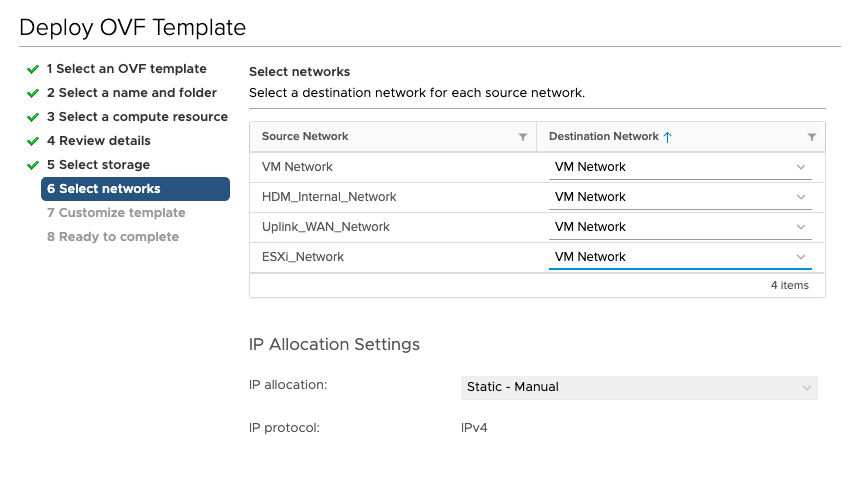

---
- 'title:"Network Planning"'
---

Your network topology choices determine how the HDM components will be configured within your network. It also dictates how VMs will be migrated to best support post-migration network security and VM isolation requirements. 

HDM provides the following network configuration flexibility:

1. Choice of networks HDM components should use
2. Choice of IP allocation type for HDM components

#### **Network Types**

An ideal network configuration isolates various types of network traffic for maximum security, performance, and access control. HDM assumes the following types of networks can be present in the environment:

1. Management Network (VM Network): This network usually maps to the VM network and provides access to vCenter. All management API communications with vCenter take place over this network.
2. ESXi Network (ESXi_Network): This network usually maps to the VM network and provides access to ESXi.
3. HDM Internal Network (HDM_Internal_Network): This network is used by HDM for communication among its components. It is recommended to configure a dedicated low latency network for this purpose. This network is illustrated in figure 2 as _PrimaryIO On-Premises_ and _PrimaryIO Cloud_.
4. WAN Network (Uplink_WAN_Network): This network provides access to the cloud. All data transfers between the on-premises and cloud environments take place over this network, via either a public link or a direct connection.
5. Application Network: This network facilitates application VM data transfers; each application can employ its own network.

_Figure 2: How HDM utilizes the various network types_

**NOTES:**

1. During deployment, HDM components are configured to access necessary data store and meet component communication requirements.
2. During HDM deployment, discovered vCenter networks must be categorized according to the types discussed in this section (figure 3). 

_Figure 3: Selecting and Categorizing Networks_

**NOTE: **While each traffic type should ideally employ its own network, configurations that allow one or multiple types of traffic to utilize the same network are also supported by HDM.

#### HDM Networking for Test: Single Network Topology

HDM can be deployed in test environments where there may not be separation between the various network types. In this situation, the network configuration would be simplified as illustrated in figure 4. In this case, you will need to map all of the “Source Networks” to the VM Network or the Management Network during the deployment process (figure 5).

_Figure 4: Test Environment Configuration_

_Figure 5: Mapping Source and Destination Networks in a Single Network Test Environment_

#### **IP Allocation**

HDM supports DHCP and static IP protocols. The protocol to be used must be selected during the HDM deployment process. When choosing static IP, an IP allocation range must be provided. The number of IPs required will depend on the number of nodes in the cluster and the deployment mode chosen. 

**NOTE**: HDM does not support changing the IP address or associated details, once the system has been deployed with a given set of values (Appliance as well as other component VMs). Redeployment is required if IP for HDM components needs to be changed. 

### **OS Requirements**

There are no OS limitations for cold migration. 

