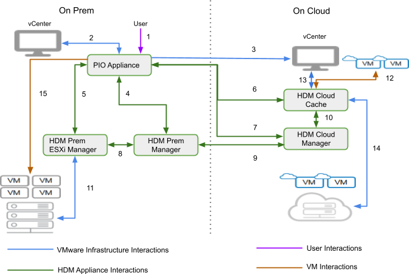

# Prepare to migrate

The following operations are done on the guest VM for prepare to migrate.

### Linux

For a Support Linux OS we will
1. Check iscsi initiator drivers installed (install if not)
1. Add iscsi driver to initrd.
1. Add flag in kernel boot to allow iSCSI booting.

### Windows

For a Supported Windows OS we will
1. Disable WFP(Windows Filtering Platform) Lightweight Filter bindings from the NIC which will be used for iSCSI booting.
1. Turning on the 'msiscsi' service and setting 'service_start_mode' to 'automatic' so it will be going to autostart on each boot.
1. [add what packages will be added]
1. [what files are added with what permissions]
1. [Which site are we downloading additional packages.]

# HDM - Component Interactions

## Introduction

The document describes the interactions between HDM components and VMware Infrastructure both on premise and on cloud. The document would describe the authentication mechanism, permissions and network connectivity required for these interactions.

1. User interaction with HDM PIO Appliance
    1. Authentication - User credentials
    2. Port - 22 (TCP), 443 (TCP) 
        1. Details
            1. User interactions with the PIO appliance over a web interface over HTTPS. HTTPS is configured with a self signed certificate initially.
            2. SSH for optional PrimaryIO customer support access.
2. HDM PIO Appliance to on-premise vCenter
    3. Authentication - User credentials
    4. Port - 443 (TCP)
        2. Details
            3. PIO Appliance uses vSphere API to interact with vCenter to manage:
            4. Plugin - Requires read and write permissions to register HDM vCenter plugin. HDM plugin provides interfaces to configure, monitor, manage and migrate virtual machines.
            5. Catalog - Requires read and write permission to Create catalog, Upload OVF,  Delete Catalog Item and Delete Catalog. HDM uploads OVF which are then required to deploy HDM appliances during the initial configuration.
            6. Virtual machine - Requires read and write permission to deploy/ create virtual machines, manage virtual machines and delete virtual machines. These permissions are required during HDM appliance deployment and virtual machine migration.
            7. ESXi - Requires permission to install VMware certified VAIO filter.
            8. Storage Policy Based Management - Required read and write permission to create, modify and delete storage policies.
3. HDM PIO Appliance to on-cloud vCenter
    5. Authentication - User credentials
    6. Port - 443 (TCP)
    7. Details
        3. PIO Appliance uses vSphere API to interact with vCenter to manage:
            9. Catalog - Requires read and write permission to Create catalog, Upload OVF,  Delete Catalog Item and Delete Catalog. HDM uploads OVF which are then required to deploy HDM appliances during the initial configuration.
            10. Virtual machine - Requires read and write permission to deploy/ create virtual machines, manage virtual machines and delete virtual machines. These permissions are required during HDM appliance deployment and virtual machine migration.
4. HDM PIO Appliance to HDM Prem Manager
    8. Authentication - User credentials
    9. Authorization - SSL certificate
    10. Ports - 22 (TCP), 443 (TCP), 2376 (TCP), 8000-8010 (TCP), 32820 (TCP)
    11. Details
        4. PIO Appliance uses port 2376 to deploy and manage HDM services containerized within HDM Prem Manager
        5. SSH access is required for initial configuration.
        6. Service level interaction between HDM services is over HTTPS authorized using SSL certificates.
        7. IO Analyzer summaries created in ESXi are pushed to PIO Appliance using port 32820
        8. 8000-8010 used for internal service configuration authorized using SSL certificates.
5. HDM PIO Appliance to HDM Prem ESXi Manager
    12. Authentication - User credentials
    13. Authorization - SSL certificate
    14. Ports - 22 (TCP), 443 (TCP), 2376 (TCP), 8000-8010 (TCP)
    15. Details
        9. PIO Appliance uses port 2376 to deploy and manage HDM services containerized within HDM Prem ESXi Manager
        10. SSH access is required for initial configuration.
        11. Service level interaction between HDM services is over HTTPS authorized using SSL certificates.
        12. 8000-8010 used for internal service configuration authorized using SSL certificates.
6. HDM PIO Appliance to HDM Cloud Cache
    16. Authentication - User credentials
    17. Authorization - SSL certificate
    18. Ports - 22 (TCP), 443 (TCP), 2376 (TCP), 8000-8010 (TCP)
    19. Details
        13. PIO Appliance uses port 2376 to deploy and manage HDM services containerized within HDM Cloud Cache
        14. SSH access is required for initial configuration.
        15. Service level interaction between HDM services is over HTTPS authorized using SSL certificates.
        16. 8000-8010 used for internal service configuration authorized using SSL certificates.
7. HDM PIO Appliance to HDM Cloud Manager
    20. Authentication - User credentials
    21. Authorization - SSL certificate
    22. Ports - 22 (TCP), 443 (TCP), 2376 (TCP), 8000-8010 (TCP)
    23. Details
        17. PIO Appliance uses port 2376 to deploy and manage HDM services containerized within HDM Cloud Manager
        18. SSH access is required for initial configuration.
        19. Service level interaction between HDM services is over HTTPS authorized using SSL certificates.
        20. 8000-8010 used for internal service configuration.
8. HDM Prem ESXi Manager to HDM Prem Manager
    24. Authentication - User credentials
    25. Authorization - SSL certificate
    26. Ports - 5000-5010 (TCP), 12000-12010 (TCP)
    27. Details
        21. 5000-5010, 12000-12010 are used for Internal data transfer.
9. HDM Prem Manager to HDM Cloud Manager (**Across Site to Site Network Interconnect**)
    28. Authentication - User credentials
    29. Authorization - SSL certificate
    30. Ports - 22 (TCP), 443 (TCP), 6000-6010 (TCP), 7000-7010 (TCP)
    31. Details
        22. Data transfer between the HDM prem manager and HDM cloud manager happens over port 600x and 700x. The data is compressed and encrypted before being transferred across the “interconnect”.
        23. SSH access is required for initial configuration.
        24. Service level communication across HDM components is over HTTPS using the SSL certificates.
10. HDM Cloud Manager and HDM Cloud Cache
    32. Authentication - User credentials
    33. Authorization - SSL certificate
    34. Port - 32820 (TCP), 5000-5010 (TCP), 12000-12010 (TCP)
    35. Details
        25. IO Analyzer summaries created on HDM cloud cache are pushed to HDM Cloud Manager over port 32820.
        26. 5000-5010, 12000-12010 are used for Internal data transfer.
11. HDM Prem ESXi Manager and on-premise ESXi
    36. Authentication - User credentials
    37. Authorization - VMware Authorization
    38. Port - 902 (TCP), 32821 (TCP), 32822 (TCP)
    39. Details
        27. Read and Write of data from and to VMDK is managed by HDM Prem ESXi Manager is done on port 32821 and 32822. 
        28. Port 902 is required for Network File Copy (NFC)
12. HDM Cloud Cache to Virtual machines running on cloud over cache
    40. Authentication - User credentials 
    41. Authorization - Data Encrypted
    42. Ports - 3260 (TCP), 9001 (TCP), 9002 (TCP)
    43. Details - 
        29. Virtual machines running over cache on cloud boots over iSCSI port 3260.
        30. 9001, 9002 is used for data Transfer using MicroVM.
13. HDM Cloud Cache to Cloud vCenter 
    44. Authentication - vCenter User Credentials
    45. Authorization - VMware Authentication
    46. Ports - 443 (TCP)
    47. Details
        31. HDM cloud cache requires access to on cloud vCenter at port 443 to authenticate access to ESXi at port 443 and 902 to write data to the VMDK.
14. HDM Cloud Cache to VMDK/ Disks on Cloud
    48. Authentication - vCenter User Credentials
    49. Authorization - VMware Authentication
    50. Ports - 443 (TCP), 902 (TCP)
    51. Details
        32. HDM cloud cache requires access to on cloud vCenter at port 443 to authenticate access to ESXi at port 443 and 902 to write data to the VMDK.
15. PIO Appliance to Virtual machines on premise
    52. Authentication - Sudo/ Admin user credentials
    53. Authorization - User credentials
    54. Port - 443 (TCP)
    55. Details
        33. Virtual machines that need to be migrated to the cloud using warm migration will need to be prepared on premise.
        34. PIO Appliance uses VMware Guest Tool to insert scripts to check and configure the following:
            11. Check VMware tool versions
            12. Check OS version
            13. Check iSCSI initiator configuration. If not installed, installs iSCSI initiator and configures VM boot over iSCSI on cloud